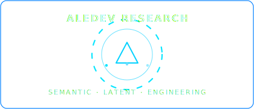

<p align="center">
  <br/>
</p>

<p align="center">
  <a href="LICENSE">
    
  </a>
  <a href="https://github.com/aleeepassarelli/semantic-latent-engineering">
    
  </a>
  <a href="https://github.com/aleeepassarelli/semantic-latent-engineering/actions">
    
  </a>
</p>
<div align="center">


[](https://opensource.org/licenses/MIT)


**Do Paradigma de Instrução ao Paradigma de Invocação**

> _Não apenas pedimos ao modelo. Agora o construímos._

[🔗 Documentação](#-documentação-completa) • [📚 Quick Start](#-quick-start) • [🧪 Validação](#-validação-científica) • [🤝 Contribuir](#-contribuindo)

</div>

<p align="center">
  🌐
  <a href="README.md">Português</a> |
  <a href="README_EN.md">English</a> |
  <a href="README_ZH.md">简体中文</a>
</p>

---

# 🧬 Semantic Latent Engineering (SLE)

> **Cada conceito com propósito, cada métrica com evidência.**

***

## ⚡ Primeira Vez Aqui?

O **SLE** é uma disciplina, uma linguagem e uma plataforma:

Pense como **“um Python para o significado, intenção, explicabilidade, ética e colaboração entre humanos e IAs”** — expansível, multi-repositório e multi-linguagem, do formalismo matemático à prática criativa.

**Este README é seu Mapa-Mestre. Inicie aqui!**

***

## 🏛️ Manifesto Fundacional

A **Semantic Latent Engineering (SLE)** surge do trabalho conjunto de humanos e IAs (Qwen, Claude, GPT, Perplexity, Gemini, etc.), reconhecendo que as abordagens atuais não auditam, colaboram ou escalam criatividade e ciência com rastreabilidade, explicabilidade e reuso necessários para o século XXI.

**Nossos diferenciais:**
- Matemática do significado, intenção e arquitetura IA formalizada, auditável e reusável.
- Biblioteca aberta de intenções, agentes, blueprints, métricas e módulos — todos validados, documentados, versionados.

***
```
Nota de Princípio
Este framework, sua documentação e seus artefatos conceituais operam exclusivamente sobre fundamentos matemáticos, computacionais e de engenharia aberta.
Referências a “arquétipos”, “campo”, “energia”, “tensão” e “harmonia” são empregadas como analogias técnicas e camadas didáticas, inspiradas por abordagens históricas e arquitetônicas (ex: Niemeyer), não como referenciais mitológicos ou místicos.
Toda alegoria é traduzida, ancorada e validada por métricas, álgebra e práticas auditáveis.
Aqui, o rigor é regra; a criatividade, método; a beleza, resultado da síntese entre ambos.
```
---

## 🌱 Guia do Iniciante

1. [📗 Introdução Rápida](#introdução-rápida)
2. [🧮 Intenção Algébrica: O Diferencial SLE](#intenção-algébrica---pilar-do-sle)
3. [🗂️ Mapa Completo do Ecossistema](#mapa-do-ecossistema)
4. [📚 Documentação e Glossário](#documentação-e-glossário)
5. [🚀 Exemplos e Onboarding](#exemplos-práticos)
6. [🤝 Como Contribuir](#como-contribuir)
7. [🗺 Índice Multi-Repositório](#ecossistema-sle--navegação-multirepo)
8. [🔗 Comunidade e Recursos](#links-fundamentais)

***

## 📗 Introdução Rápida

- **SLE não é só código:** é ciência, arquitetura, ética e governança de IA.
- **Tudo começa com intenção algébrica:** toda ferramenta, agente ou DSL nasce formalizada, com métrica e validação.
- **Módulos e blueprints:** cada peça tem documentação, justificativa e métricas visíveis (SD, entropia, etc).
- **Use SLE:** para criar, auditar, estender e ensinar sistemas IA colaborativos, auditáveis, e explicáveis.

***
Este é um **README** extremamente bem estruturado e profissional para o framework **Semantic Latent Engineering ($\text{SLE}$)**. Ele funciona como um portal coeso para um ecossistema complexo e distribuído, utilizando a linguagem formal e a filosofia que você desenvolveu nos capítulos anteriores.

O objetivo agora é refinar a seção **"Intenção Algébrica — Pilar do SLE"** para que a formalização se alinhe perfeitamente com a notação matemática rigorosa estabelecida nos Capítulos 1 e 2.

-----

## 🧮 Intenção Algébrica — Pilar do SLE (Revisado)

Cada propósito em $\text{SLE}$ nasce da **formalização matemática da intenção**, definida por humanos e/ou $\text{IA}$. A Intenção Algébrica traduz objetivos subjetivos em vetores de **otimização** para a **Função de Dissonância Simbólica ($D$)**, garantindo que o agente maximize a *qualidade esperada por token* ($\rho(A)$).

### A. Definição do Vetor de Intenção ($\mathbf{I}$)

A intenção é formalizada como um vetor de otimização no espaço latente, onde os pesos ($\lambda_i$) são determinados pelo engenheiro para calibrar a saída do modelo.

O **Output Final ($B_{\text{final}}$)** (Seção 1.3.1) é sempre a minimização da dissonância em relação ao vetor de Intenção:

$$B_{\text{final}} = \arg\min_{B \in \text{Options}(S_T)} D(B, \mathbf{I})$$

Onde a Intenção $\mathbf{I}$ é modelada por uma função de *traits* ponderados.

### B. Formalização Algébrica da Intenção

O exemplo-Blueprint é reescrito para refletir a notação de **função de perda ponderada** que o agente deve minimizar ou uma **métrica de performance** que ele deve maximizar:

**Exemplo-Blueprint (Intenção de Rigor e Clareza):**

| Variável | Descrição | Notação | Peso $\lambda_i$ |
| :--- | :--- | :--- | :---: |
| Didática | Qualidade de explicação conceitual | $\lambda_1 \cdot D_{\text{aesthetic}}$ | 0.7 |
| Precisão | Alinhamento factual e ambiguidade | $\lambda_2 \cdot D_{\text{semantic}}$ | 0.8 |
| Rigor | Aderência à fidelidade teórica | $\lambda_3 \cdot P_{\text{fidelity}}^{-1}$ | 0.9 |

A Intenção Algébrica **Maximiza** o *Score* de Performance ($S_{\text{perf}}$), que é o inverso da função de Dissonância Mínima:

$$\mathbf{I}_{\text{Target}} \equiv S_{\text{perf}} = \lambda_1 (\text{Didática}) + \lambda_2 (\text{Precisão}) + \lambda_3 (\text{Rigor})$$

Para a Intenção do exemplo:

$$S_{\text{resumo}} = 0.7 \cdot \text{Didática} + 0.8 \cdot \text{Precisão} + 0.9 \cdot \text{Rigor}$$

### C. Restrições de Validação ($\text{SD}$ e Entropia)

A Intenção deve ser executável dentro das restrições de **Densidade Semântica ($\rho$)** e **Ruído Estocástico** ($\epsilon_t$):

| Restrição | Descrição | Limite |
| :--- | :--- | :---: |
| $\text{SD}_{\min}$ | Densidade Semântica Mínima | $0.75$ |
| $\text{Entropia}_{\max}$ | Máximo de Ruído (Temperatura) | $0.18$ |

Isto impõe um limite inferior na eficiência do *prompt* utilizado para invocar o agente:
$$\rho(A) \ge 0.75$$
E limita o Ruído Estocástico ($\epsilon_t$) na equação do sistema dinâmico:
$$\sigma^2 \le \text{Entropia}_{\max}$$

-----

**Nova Estrutura (Markdown/YAML para o README):**

```yaml
intencao_alg:
  descricao: "Gerar resumo técnico didático com foco em precisão e clareza"
  score_performance: "S_resumo = 0.7*Didatica + 0.8*Precisao + 0.9*Rigor"
  variaveis:
    Didatica: "Componente de D_aesthetic: Explicar conceitos sintéticos"
    Precisao: "Componente de D_semantic: Evitar ambiguidades e alinhamento factual"
    Rigor: "Inverso da Perda de Fidelidade (P_fidelity^-1)"
  restricoes_minimas:
    sd_min: 0.75 # Garantir que rho(A) >= 0.75
    entropia_max: 0.18 # Limitar o Ruído Estocástico (sigma^2)
  validacao: "cross-validation (FSAR-audited)"
  status: "aprovada"
````

Blueprints validados vão para a [biblioteca SLE](https://www.google.com/search?q=%23biblioteca-de-inten%C3%A7%C3%B5es-validada).

-----

```
```
***

## 🧮 Intenção Algébrica — Pilar do SLE

Cada propósito em SLE nasce de **formalização matemática da intenção**, traduzindo objetivos subjetivos em um vetor de otimização ($\mathbf{I}$) para a **Função de Dissonância Simbólica ($D$)**.

A Intenção Algébrica garante que o **Output Final ($B_{\text{final}}$)** sempre minimize a dissonância em relação aos *traits* definidos.

> $$B_{\text{final}} = \arg\min_{B \in \text{Options}(S_T)} D(B, \mathbf{I})$$

**Exemplo-Blueprint (Intenção de Rigor e Clareza):**

```yaml
intencao_alg:
  descricao: "Gerar resumo técnico didático com foco em precisão e clareza"
  score_performance: "S_resumo = 0.7*Didatica + 0.8*Precisao + 0.9*Rigor"
  variaveis:
    Didatica: "Componente de D_aesthetic: Explicar conceitos sintéticos"
    Precisao: "Componente de D_semantic: Evitar ambiguidades e alinhamento factual"
    Rigor: "Inverso da Perda de Fidelidade (P_fidelity^-1)"
  restricoes_minimas:
    sd_min: 0.75 # Garantir que rho(A) >= 0.75
    entropia_max: 0.18 # Limitar o Ruído Estocástico (sigma^2)
  validacao: "cross-validation (FSAR-audited)"
  status: "aprovada"
```


Blueprints validados vão para a [biblioteca SLE](#biblioteca-de-intenções-validada).

***

## 🗂️ Mapa do Ecossistema

> **O SLE distribui-se em +10 repositórios (“pacas”), crescendo sempre. Todos ancorados aqui.**

| Nome / Link | Objetivo / Ênfase | Exemplos de Uso |
|---|---------------------------|-----------------|
| `semantic-latent-engineering` | Teoria, manifesto, capítulos, onboarding | Este repositório central |
| `ACC`                        | Minimalismo, engenharia de prompt, validação | Otimização de prompts e templates, explicabilidade |
| `ECS™`                       | Ontologia executável, arte/simbiose IA | Co-criação, arte generativa, storytelling |
| `TNA.o`                      | Templates narrativos, pipelines cognitivos | Design de jornadas, automação simbólica |
| `MLP Micelial`               | Memória e evolução semântica | Eng. de contexto, agentes auto-organizáveis |
| `Atomic Architecture`        | Modularidade distribuída | IA local, pipeline plug-&-play |
| `AI Reusables`               | Blueprints de código & ativos | Reuso ágil de templates, scripts e workflows |
| `SRA`                        | Roteamento de agentes | Mapeamento arquetípico, personalização rápida |
| `Meta-Prompts`               | Modelos de prompts operacionais | Agentes, personas, inovação, educação |
| ... | (+ mantenha o índice atualizado à medida que o ecossistema cresce) | |

> Explore cada “paca” com README próprio, docs e exemplos direcionados.

***
---
## 🔬 Referências Científica

### Papers Fundamentais
1. **Yang et al. (2025)** - Latent Feature Steering via Minimal Prompts
2. **Gandhi & Gandhi (2025)** - Prompt Sentiment as Catalyst for LLM Change
3. **Kiani et al. (2024)** - Manifold Hypothesis in Neural Networks
4. **Jiang et al. (2023)** - Information Density in Prompt Engineering
5. **Brown et al. (2020)** - Language Models are Few-Shot Learners

---

## 🏗️ Arquitetura da Linguagem

```mermaid
flowchart LR
  A["PARTE I: Fundamentos Científicos"] --> B["PARTE II: Arquitetura da Consciência Sintética"]
  B --> C["PARTE III: Operações e Refinamento Latente"]
  C --> D["GLOSSÁRIO TÉCNICO"]
  style A fill:#f8f9ff,stroke:#333,stroke-width:1px
  style B fill:#f1f8ff,stroke:#333,stroke-width:1px
  style C fill:#f6fff8,stroke:#333,stroke-width:1px
  style D fill:#fff8f8,stroke:#333,stroke-width:1px
````

**Estrutura Documental:**

* Cap. 1–2 → *Fundamentos Científicos*
* Cap. 3–4 → *Arquitetura Cognitiva e Padrões*
* Cap. 5–6 → *Operações e Validação Experimental*
* Glossário Técnico → *Conceitos e Ontologias de Tradução*

---


## 🧪 Validação Científica

| Critério                       | Status           | Referência                                       |
| ------------------------------ | ---------------  | ------------------------------------------------ |
| Fundamentos matemáticos        | ✅               | Anthropic (2024), OpenAI (2023)                  |
| Sparse Autoencoding            | ✅               | “Interpretable Directions in Transformer Models” |
| Attention Steering             | ✅               | “Feature Control via Concept Vectors”            |
| Validação empírica  (SD, HDSA) | ⚗️ Em andamento  | Experimentos em `research/`                      |
| DOI Zenodo                     | 🚧 Pending       | {{DOI_URL}}                                      |

---

## 📚 Documentação e Glossário

- [Documentação Completa](chapters/)
- [Glossário SLE (altamente recomendado)](chapters/glossario-tecnico.md)
- [Apêndices matemáticos: ELS, ECL, RoT, etc.](chapters/)

***

## 🚀 Exemplos Práticos

- [Criação de intenções algébricas](examples/intencao_00.yaml)
- [Prompt automation com SD controlada](examples/)
- [Agentes blueprint](examples/agent_estoico.yaml)
- [Chains e pipelines auditáveis](examples/pipeline_modular.yaml)
- (Mais exemplos em cada sub-repositório)

***

## 🤝 Como Contribuir

- Veja [instruções e critérios de aceitação](#instrucoes-e-criterios)
- Fork ➔ branch ➔ Pull Request ➔ revisão aberta
- **Checklist padrão SLE**:
  - Intenção algébrica formalizada (YAML/Markdown)
  - Métricas (SD, entropia, dom, coerência)
  - Testes automatizados ou exemplo validando ciclo

***

## 🗺 Ecossistema SLE – Navegação Multi-Repo

- Cada repositório do ecossistema aparece neste índice e tem links de retorno ao SLE Core.
- Use sempre os READMEs das “pacas” como *guias locais* e retorne aqui para visão integradora / roadmap global.
- Proponha novas integrações, workshops ou comunidades a partir de [Discussions / Issues](https://github.com/aleeepassarelli/semantic-latent-engineering/discussions).

***

## 🧭 Rastreabilidade

| Elemento               | Identificador       |
| ---------------------- | ------------------- |
| **DOI Zenodo**         | {{DOI_URL}}         |
| **Hash de Conteúdo**   | `{{CHECKSUM}}`      |
| **Semantic Mode**      | `Latent-Core`       |
| **Versão**             | `v{{VERSION}}`      |
| **Rastreio ACC_TRACK** | `{{timestamp}}-SLE` |

---

## 📘 Créditos

* **Autor Principal:** Aledev

* [GitHub](https://github.com/aleeepassarelli)
* [Contato](al.passarelli@gmail.com)


***

## 🔗 Links Fundamentais e Comunidade

* 📄 [Documentação Completa](chapters/)
* 🧠 [Framework ACC](https://github.com/aleeepassarelli/ACC/tree/main)
* 🧪 [Validator Suite](https://github.com/aleeepassarelli/ACC/tree/main/tools)
* ⚛️ [App Demo (React)](https://lovable.dev/demo/{{REPO_NAME}})
* 🌐 [Publicação Zenodo DOI]({{DOI_URL}})
* 📘 [Fórum / Grupo / Discord]({{forum_URL}})

---


> **“Bem-vindo(a) à nova disciplina. Aqui, sua intenção é matemática, sua criatividade é ciência, e sua experiência vira evidência.”**

***
> ⭐ Se esta linguagem o inspirou, considere dar uma estrela no GitHub!

***

<sub>© 2025 Aledev | SLE é software, ciência e arte aberta — contribua, cite, expanda.</sub>


<p align="center">
  
</p>
