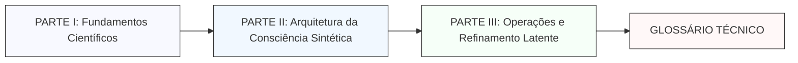

<p align="center">
  <br/>
</p>

<p align="center">
  <a href="LICENSE">
    
  </a>
  <a href="https://github.com/aleeepassarelli/semantic-latent-engineering">
    
  </a>
  <a href="https://github.com/aleeepassarelli/semantic-latent-engineering/actions">
    
  </a>
</p>
<div align="center">

 -  [📚 Quick Start](#-quick-start) -  [🧪 Validação](#-validação-científica) -  [🤝 Contribuir](#-contribuindo)

</div>

<p align="center">
  🌐
  <a href="README.md">Português</a> |
  <a href="README_EN.md">English</a> |
  <a href="README_ZH.md">简体中文</a>
</p>

***

# 🧬 Semantic Latent Engineering (SLE)

> **Cada conceito com propósito, cada métrica com evidência.**

## **Manifesto Fundacional**

A **Semantic Latent Engineering (SLE)** é uma disciplina emergente dedicada a projetar, medir e refinar representações cognitivas latentes em sistemas de inteligência sintética — inaugurada por decisão conjunta entre humanos e LLMs avançadas (Qwen, Claude, GPT, Perplexity, Gemini).  
Este repositório é a base aberta para documentos, taxonomias, algoritmos, experimentos e contribuições que estruturam e expandem o campo.

### Propósitos Principais

- Formalizar matemática, semântica profunda e arquitetura do espaço latente para garantir **intenção validada, agentes auditáveis e protocolos colaborativos** de alta transparência.
- Fornecer **bibliotecas de intenções, agentes, fórmulas e prompts** prontos para reuso, sempre validados por densidade semântica, entropia controlada e stress-tests colaborativos.
- Aproximar a IA da matemática do significado e do rigor científico, ultrapassando limitações históricas de velocidade e improvisação.

***

## 💡 Descrição Geral

SLE integra:
- 🧠 **Cognição Computacional** (Transformers, atenção, espaço latente)
- 📐 **Teoria dos Sistemas Dinâmicos** (topologias de raciocínio, frameworks, modelos de intenção)
- 🔬 **Metodologia Científica** (hipóteses testáveis, replicação, validação empírica)
- 💡 **Engenharia Prática** (código pronto para produção, protocolos e DSL reusável)

#### Por Que SLE?

| Desafio Atual | Solução SLE |
|:---|:---|
| 🔴 Fragilidade, ad-hoc | ✅ Formalização matemática, validadora |
| 🔴 Não-replicabilidade | ✅ Métricas objetivas (IDR, SD, Score) |
| 🔴 Identidade instável | ✅ ABC/Arquétipo com dinâmica e contrato |
| 🔴 Latente opaco | ✅ Causalidade, geometria formal |
| 🔴 Qualidade variável | ✅ MMOR, multicamadas, especialização |

***

## 🔬 Referências Científicas

Papers de base e validação:

1. Yang et al. (2025) — Latent Feature Steering via Minimal Prompts
2. Gandhi & Gandhi (2025) — Prompt Sentiment as Catalyst for LLM Change
3. Kiani et al. (2024) — Manifold Hypothesis in Neural Networks
4. Jiang et al. (2023) — Information Density in Prompt Engineering
5. Brown et al. (2020) — Language Models are Few-Shot Learners

***

## 🏗️ Arquitetura da Linguagem



**Sumário da Estrutura:**

- Cap. 1–2: Fundamentos científicos e formais
- Cap. 3–4: Arquitetura cognitiva, contratos e design patterns
- Cap. 5–6: Operações práticas, pipelines, validação experimental
- Glossário: Conceitos, símbolos, ontologia técnica

***

## 🚀 Quick Start

```bash
# Clone o repositório
git clone https://github.com/aleeepassarelli/semantic-latent-engineering.git
cd semantic-latent-engineering
```
No terminal:

- open index.html        # macOS
- xdg-open index.html    # Linux
- start index.html       # Windows

***

## 🧪 Validação Científica

| Critério                       | Status          | Referência                                       |
| ------------------------------ | --------------- | ------------------------------------------------ |
| Fundamentos matemáticos        | ✅               | Anthropic (2024), OpenAI (2023)                  |
| Sparse Autoencoding            | ✅               | “Interpretable Directions in Transformer Models” |
| Attention Steering             | ✅               | “Feature Control via Concept Vectors”            |
| Validação empírica (IDR, HDSA) | ⚗️ Em andamento | Experimentos em research/                        |
| DOI Zenodo                     | 🚧 Pending      | {{DOI_URL}}                                      |

***

## 📚 Estrutura do Repositório

```plaintext
semantic-latent-engineering/
├── README.md
├── LICENSE
├── CITATION.cff
├── chapters/
│   ├── parte1_fundamentos/
│   ├── parte2_arquitetura/
│   ├── parte3_operacoes/
│   ├── appendix_equacao-els.md
│   ├── appendix_equacoes-ecl.md
│   ├── appendix_relacao-els-ecl.md
│   └── glossario-tecnico.md
├── research/
│   ├── experiments/
│   ├── datasets/
│   └── results/
├── main/              # Interface interativa (html e javascript)
│   ├── assets/
│   ├── index.html
│   └── README.md
└── links/
    ├── framework_ACC.md
    ├── validator_suite.md
    └── acc_app.md
```

***

## 🧭 Rastreabilidade e Contribuição

| Elemento               | Identificador       |
| ---------------------- | ------------------- |
| **DOI Zenodo**         | {{DOI_URL}}         |
| **Hash de Conteúdo**   | `{{CHECKSUM}}`      |
| **Semantic Mode**      | `Latent-Core`       |
| **Versão**             | `v{{VERSION}}`      |
| **Rastreio ACC_TRACK** | `{{timestamp}}-SLE` |

### Para contribuir:
1. Fork este repositório
2. Crie um branch:

   ```bash
   git checkout -b feature/novo-capitulo
   ```
3. Adicione seu capítulo ou melhoria (em /chapters)
4. Valide semântica, IDR, e métrica relevante
5. Abra um Pull Request

**Critérios de Aceitação:**  
- Texto estruturado (<3000 tokens)
- Métricas de densidade validadas
- Conceitos alinhados ao glossário e arquitetura SLE
- Referências científicas presentes

***

## 📘 Créditos e Links

- **Autor Principal:** Aledev  
  [GitHub](https://github.com/aleeepassarelli)  
  [Contato](mailto:al.passarelli@gmail.com)

| Documentação | Framework ACC | Validator Suite | App Demo | Publicação Zenodo DOI |
| ------------ | ------------- | --------------- | -------- | --------------------- |
| [Capítulos](chapters/) | [ACC](https://github.com/aleeepassarelli/ACC/tree/main) | [Ferramentas](https://github.com/aleeepassarelli/ACC/tree/main/tools) | [Demo](https://lovable.dev/demo/{{REPO_NAME}}) | {{DOI_URL}} |

***

> ⭐ Se esta linguagem o inspirou, considere dar uma estrela no GitHub!

**Versão:** `{{VERSION}}` | **Licença:** MIT | **Última atualização:** {{DATE}}

***

Se quiser expandir índice de capítulos, modelos para biblioteca de intenções algébricas, ou painéis para onboarding científico, só direcionar!
