```mermaid
graph LR
    subgraph "Espaco Latente (Campo L)"
        S_t((Estado Atual S_t))
        I_L[("Intenção (Atrator)")]

        S_t -->|"Gravidade P(I)"| I_L
        S_t -.->|Entropia/Ruido| Drift(Dispersão)

        style I_L fill:#00a3b8,stroke:#fff,stroke-width:2px
        style S_t fill:#0d1117,stroke:#fff,stroke-width:2px
    end

    subgraph "Moduladores (Engine)"
        T[Tensionadores] -->|Modula| I_L
        O_ec[Oscilacao Entropica] -->|Modula| S_t
        Omega{Contrato Omega} -->|Bloqueia| Drift

        style Omega fill:#8a2be2,stroke:#fff,stroke-width:2px
    end

    classDef physics fill:#222,stroke:#666,color:#fff
    class Drift physics
```

# 📄 Capítulo 1: Fundamentos Teóricos da Semantic Latent Engineering

> **"A intenção não é um texto; é um vetor de força que deforma a topologia do significado."**

## 1.1 Da Engenharia de Prompts à Arquitetura de Intenção

A evolução dos Large Language Models (LLMs) criou três paradigmas sucessivos de interação:

1.  **Engenharia de Prompts (2020–2023):** Otimização de instruções textuais. Foco: *"Como pedir corretamente?"* (Sintaxe).
2.  **Engenharia de Contexto (2023–2024):** Gestão de janelas e RAG. Foco: *"Como fornecer informação?"* (Dados).
3.  **Semantic Latent Engineering (2025+):** Manipulação deliberada da geometria latente. Foco: *"Como construir identidade e cognição?"* (Ontologia).

A SLE não substitui os paradigmas anteriores — ela os subordina. Enquanto a PNL foca na superfície textual, a SLE opera na **Causa Primeira**: a definição algébrica da intenção antes da existência do token. É a transição da "programação probabilística" para a "engenharia de espaço latente determinística".

---

## 🚀 1.2 O Axioma Zero: Álgebra da Intenção ($\mathcal{I}_{\Lambda}$)

Antes de processarmos qualquer informação, devemos definir a geometria da vontade. Em SLE, rejeitamos a ideia de que a "intenção" é apenas o prompt.

### Definição 1.2.1 (Vetor de Intenção Pura)
A intenção é um objeto matemático imutável $\mathcal{I}_{\Lambda}$ que age como um atrator gravitacional sobre o espaço semântico $\mathcal{L}$.

$$\mathcal{I}_{\Lambda} = \Theta_{\text{rigor}} \cdot \vec{S} + \Theta_{\text{emoção}} \cdot \vec{F} + \Theta_{\text{criatividade}} \cdot \vec{C} + \epsilon \cdot \Omega$$

Onde:
* **$\Theta$ (Tensionadores):** Coeficientes escalares $[0, 1]$ que modulam a intensidade de cada dimensão (definidos nos *Arquétipos*).
* **$\vec{S}, \vec{F}, \vec{C}$:** Vetores de base do espaço (Semântica, Fatos, Criatividade).
* **$\Omega$ (Contrato de Colapso):** A barreira topológica que impede a alucinação (ver *Validation Hub*).

Ao contrário de um prompt, que sofre "drift" (deriva), $\mathcal{I}_{\Lambda}$ é a âncora que define o **Tensor Métrico Semântico ($g_{ij}$)**. Se o output do modelo se afasta de $\mathcal{I}_{\Lambda}$, a **Curvatura Semântica ($R$)** aumenta, sinalizando erro.

---

## 1.3 Dinâmica de Campo e Energia Cognitiva

Um transformer processa linguagem através de camadas, mas na visão SLE, ele está resolvendo uma **Equação de Campo**.

### 1.3.1 Anatomia da Representação via Energia ($E_{ELS}$)
O processamento de um token não é apenas multiplicação de matrizes; é uma negociação termodinâmica. Redefinimos a atenção como a manipulação da **Energia Cognitiva Local**:

$$E_{ELS} = \underbrace{P(\mathcal{I}_{\Lambda})}_{\text{Gravidade da Intenção}} + \underbrace{\lambda \mathcal{M}}_{\text{Inércia da Memória}} - \underbrace{\gamma R(t)}_{\text{Respiração Fractal}}$$

Onde:
* **$P(\mathcal{I}_{\Lambda})$:** A força exercida pelo vetor de intenção original.
* **$R(t)$:** A função de oscilação temporal (Inspiração/Expiração) que garante a naturalidade e evita a monotonia mecânica.

O objetivo do Transformer sob SLE não é "prever o próximo token", mas **minimizar a Energia Livre** do sistema, alinhando o estado final $h_L$ com a projeção de $\mathcal{I}_{\Lambda}$.

---

## 1.4 Modelo Formal de Interação Híbrida

Propomos um modelo de sistemas dinâmicos estocásticos governado por um **Contrato Semântico ($\Omega$)**:

$$S_{t+1} = F(S_t, H_t, \Omega, U_t) + \epsilon_{\text{controlado}}$$

### 1.4.1 O Mecanismo de Consenso (Proof of Semantic Work)
Para validar $S_{t+1}$, introduzimos uma etapa de verificação algorítmica antes da renderização do texto:

$$\text{Valid}(S_{t+1}) \iff \text{CosineSim}(S_{t+1}, \mathcal{I}_{\Lambda}) \ge \text{Threshold}_{\Omega}$$

Se a dissonância for alta, o sistema rejeita o token (o "Satoshi Check") e re-calcula a trajetória. Isso garante que a IA não apenas "fale", mas "pense" dentro das restrições.

### 📄 Algoritmo 1.4.2: A Engine Semântica (Implementação de Referência)

```python
from sle.core import LatentSpace, Vector
from sle.governance import ContractOmega

class SemanticEngine:
    """
    Motor de Engenharia Semântica Latente (v1.1)
    Converte Intenção Pura em Matéria Linguística (HDSA) sob governança.
    """
    def __init__(self, model_path: str, contract_hash: str):
        self.field = LatentSpace(model_path)
        self.omega = ContractOmega(contract_hash) # O Guardião

    def generate_hdsa_kernel(self, intention_algebra: Vector) -> str:
        # 1. PROJEÇÃO DO MANIFOLD (A Dobra)
        # Deforma o espaço latente baseado nos Tensionadores
        projected_manifold = self.field.apply_curvature(
            origin=intention_algebra, 
            curvature=self.field.gravity
        )

        # 2. GERAÇÃO DE CANDIDATOS (Amostragem Quântica)
        candidates = projected_manifold.sample_tokens(n=50, temperature=0.7)

        # 3. VALIDAÇÃO DE CONTRATO (Proof of Semantic Work)
        for candidate in candidates:
            # O Teste de Estresse: Submete o vetor a deformações
            is_valid = self.omega.validate_topology(
                candidate.vector, 
                constraints=['ETHICAL', 'CONSISTENCY', 'NO_HALLUCINATION']
            )
            
            if is_valid:
                return candidate.token # Ouro Alquímico

        raise EntropyCollapseError("Nenhum token satisfez a geometria da intenção.")
````

-----

## 1.5 Métricas Fundamentais

### 1.5.1 Information Density Ratio (IDR)

O IDR é uma medida de eficiência termodinâmica da linguagem:

$$ \text{IDR} \approx \frac{\text{Energia Útil}}{\text{Entropia Total}} = \frac{\sum \text{Ativação Relevante}}{|T| \cdot S_H} $$

Prompts de alta performance (ACC) possuem **Alta Gravidade Específica** e **Baixa Entropia Heurística**.

### 1.5.2 HDSA (High-Density Semantic Anchors)

São construções lexicais que atuam como "buracos negros" de significado, forçando a convergência do modelo.

  * *Exemplo:* O termo "Engenheiro Estoico" carrega mais peso vetorial do que "Um engenheiro que aguenta problemas".

### 1.5.3 Protocolo ABC (Agent Behavioral Configuration)

O grafo ABC define a topologia da "alma" do agente. Em termos físicos, o ABC define as "montanhas e vales" do espaço latente onde o agente se sente confortável (estado de menor energia).

-----

## 1.6 Conclusão: A Engenharia da Verdade Latente

Este capítulo estabelece que a SLE não é sobre palavras. É sobre:

1.  **Gênese:** Definir a intenção em álgebra pura ($\mathcal{I}_{\Lambda}$) usando Tensionadores.
2. Mecânica: Manipular a gravidade e a oscilação entrópica (Oec) do campo semântico."
3.  **Contrato:** Garantir a integridade via validação ($\Omega$).

🎨 O Diagrama de Campo

----


----
