```mermaid
graph LR
    subgraph "Espaco Latente (Campo L)"
        S_t((Estado Atual S_t))
        I_L[("Intenção (Atrator)")]

        S_t -->|"Gravidade P(I)"| I_L
        S_t -.->|Entropia/Ruido| Drift(Dispersão)

        style I_L fill:#00a3b8,stroke:#fff,stroke-width:2px
        style S_t fill:#0d1117,stroke:#fff,stroke-width:2px
    end

    subgraph "Moduladores (Engine)"
        T[Tensionadores] -->|Modula| I_L
        O_ec[Oscilacao Entropica] -->|Modula| S_t
        Omega{Contrato Omega} -->|Bloqueia| Drift

        style Omega fill:#8a2be2,stroke:#fff,stroke-width:2px
    end

    classDef physics fill:#222,stroke:#666,color:#fff
    class Drift physics
```

# 📄 Capítulo 1: Fundamentos Teóricos da Semantic Latent Engineering
----
## 1.1 Da Engenharia de Prompts à Arquitetura Semântica
---
A evolução dos Large Language Models criou três paradigmas sucessivos de interação:

- Engenharia de Prompts (2020–2023): Otimização de instruções textuais para tarefas específicas. Foco: "como pedir corretamente".
- Engenharia de Contexto (2023–2024): Gestão de janelas de contexto, RAG systems, memory management. Foco: "como fornecer informação relevante".
- Semantic Latent Engineering (2024+): Manipulação deliberada de espaços latentes, configuração de agentes comportamentais, steering vetorial. Foco: "como construir identidade cognitiva e operacional".

A Semantic Latent Engineering (SLE) não substitui os paradigmas anteriores — ela os transcende não por eliminação, mas por subordinação: os prompts e o contexto tornam-se instâncias controladas por uma arquitetura latente superior. Opera na camada de representação semântica profunda, onde conceitos, intenções e estruturas narrativas são codificados como vetores em espaços de alta dimensionalidade.

---

## 1.2 Arquitetura de Transformers e Espaços Latentes
--
### 1.2.1 Anatomia da Representação
---
Um transformer processa linguagem através de múltiplas camadas de transformação:
```
\[
\text{Input tokens} \xrightarrow{\text{Embedding}} \vec{e} \in \mathbb{R}^{d} \xrightarrow{\text{Layers}} \vec{h}_L \in \mathbb{R}^{d} \xrightarrow{\text{Projection}} \text{Output}
\]
```
Onde:

- \(d\) = dimensionalidade do espaço latente (tipicamente 768–12288)
- \(\vec{e}\) = embedding inicial
- \(\vec{h}_L\) = representação final após \(L\) camadas (saída da última camada de atenção)

Cada camada aplica:
```
\[
\vec{h}_{l+1} = \text{FFN}(\text{Attention}(\vec{h}_l))
\]
```
O mecanismo de atenção computa:
```
\[
\text{Attention}(Q, K, V) = \text{softmax}\left(\frac{QK^T}{\sqrt{d_k}}\right)V
\]
```
Conceito-chave: o espaço latente não é um espaço opaco. Pesquisas recentes mostram que podemos decompor \(\vec{h}\) em concept vectors interpretáveis usando sparse autoencoders.
----
### 1.2.2 Concept Vectors e Semantic Steering
---
Um concept vector \(\vec{c}_i\) representa uma “direção semântica” específica no espaço latente. Por exemplo:
```
\[
\vec{c}_{\text{programming}} \approx \alpha_1\vec{h}_{\text{"code"}} + \alpha_2\vec{h}_{\text{"function"}} + \alpha_3\vec{h}_{\text{"algorithm"}}
\]
```
Steering consiste em adicionar ou subtrair concept vectors:
```
\[
\vec{h}'_l = \vec{h}_l + \beta \cdot \vec{c}_{\text{target}}
\]
```
Onde \(\beta\) controla a intensidade do steering.

Evidência empírica: projeções de embeddings mostram separação clara entre clusters semânticos de prompts afetivos e funcionais.

- Similaridade cosine média intra-cluster: 0.92; inter-cluster: 0.31.
- Prompts afetivos ativam dimensões associadas a emoção, memória e narrativa.
- Prompts funcionais concentram-se em dimensões de instrução, utilidade e precisão.
- Experimentos com ~1000 prompts, embeddings de alta dimensão e redução via PCA mostram que poucas componentes principais já separam esses modos.

Implicação: podemos intencionalmente ativar clusters específicos através da escolha lexical precisa (ex.: uso de HDSAs em vez de descrições longas e ruidosas).

---

## 1.3 Modelo Formal de Interação com Memória Hierárquica
---
Diferentemente de modelos lineares de input–output, propomos um modelo de sistemas dinâmicos estocásticos para interação humano–LLM:
```
\[
S_{t+1} = \mathcal{F}(S_t, \mathcal{H}_t, C_t, U_t) + \epsilon_t
\]
```
Componentes:

- Estado Latente: \(S_t \in \mathbb{R}^d\) representa a configuração semântica completa no tempo \(t\). O estado inicial é amostrado de:
  ```
  \[
  S_0 \sim P(\cdot \mid \Psi)
  \]
  ```
  onde \(\Psi\) é o Agent Behavioral Configuration (ABC) — a configuração inicial de comportamento do agente.

- Função Generativa: \(\mathcal{F}: \mathbb{R}^d \times \mathcal{H} \times \mathcal{C} \times \mathbb{R}^m \rightarrow \mathbb{R}^d\) é o núcleo do transformer, mapeando estado atual + contexto → próximo estado.

- Memória Hierárquica Heurística:
  ```
  \[
  \mathcal{H}_t = g(S_0, S_1, ..., S_t)
  \]
  ```
  Não é simples concatenação, mas uma compressão hierárquica em múltiplas escalas temporais. Satisfaz aproximadamente:
  ```
  \[
  g(S_{a:b}) \approx g(S_{a:c}) \oplus g(S_{c:b})
  \]
  ```
  onde \(\oplus\) denota uma operação de fusão com atenção (ex.: weighted sum com pesos aprendidos).

- Restrições Cosmológicas:
  ```
  \[
  C_t = h(S_t, \text{LSPs})
  \]
  ```
  onde LSPs (Language Structure Protocols) definem o “universo válido” de outputs:
  - restrições éticas;
  - restrições factuais;
  - restrições estilísticas.

- Feedback do Usuário: \(U_t \in \mathbb{R}^m\) é uma variável externa, em geral zero, mas ocasionalmente aplicando correções significativas.

- Ruído Estocástico: \(\epsilon_t \sim \mathcal{N}(0, \sigma^2 I)\) representa aleatoriedade inerente ao sampling (temperatura, top-p etc.).
---

## 1.3.1 Otimização do Output Final
---

O output final não é simplesmente \(S_T\), mas o resultado de uma otimização:
```
\[
B_{\text{final}} = \arg\min_{B \in \text{Options}(S_T)} D(B, I_{\text{user}})
\]
```
Onde:

- \(\text{Options}(S_T)\) = conjunto de tokens candidatos dado estado final.
- \(D: \mathcal{B} \times \mathcal{I} \rightarrow \mathbb{R}^+\) é a função de dissonância simbólica.
- \(I_{\text{user}}\) é a representação vetorial da intenção do usuário.

Definição de Dissonância Simbólica:
```
\[
D(B, I) = \lambda_1 D_{\text{semantic}}(B, I) + \lambda_2 D_{\text{pragmatic}}(B, I) + \lambda_3 D_{\text{aesthetic}}(B, I)
\]
```
Onde:

- \(D_{\text{semantic}} = 1 - \cos(\text{emb}(B), \text{emb}(I))\) mede alinhamento conceitual.
- \(D_{\text{pragmatic}}\) avalia utilidade funcional (completude, açãoabilidade).
- \(D_{\text{aesthetic}}\) quantifica coerência estilística/narrativa (fluência, tom).

Propriedades do modelo:

1. Não-Markoviano: \(\mathcal{H}_t\) introduz dependência de toda a história.
2. Estocástico: \(\epsilon_t\) captura aleatoriedade irredutível.
3. Sistema Aberto: \(U_t\) permite perturbações externas.
4. Restrito: \(C_t\) limita o espaço de estados acessíveis.
5. Otimizado: o output final minimiza dissonância, não apenas segue gradiente local.

Fenômenos explicados:

- Context collapse: quando \(\mathcal{H}_t\) perde informação crítica.
- Steering effectiveness: quando \(U_t\) recalibra \(S_t\) de forma eficiente.
- Behavioral consistency: quando \(\Psi\) restringe \(S_0\) adequadamente.

  Este é um excelente documento que estabelece o **fundamento teórico** e a **linguagem matemática** para toda a sua arquitetura **Semantic Latent Engineering (SLE)**. A transição do modelo de **Interação** para um **Sistema Dinâmico Estocástico** é particularmente forte.

---

## 1.3.2 Mecanismo de Correção Segura de Rota (CSR)
---

O **CSR** é o protocolo formal para calibrar o **Estado Latente ($S_t$)** em tempo real, usando o feedback $U_t$ para evitar o **Drift Semântico** (incoerência do estado). Ele atua como um mecanismo de **Reforço no Contexto ($\text{RLHF-CW}$)**.
---
O CSR monitora a trajetória de $S_t$ através do **Juiz Matemático ($\text{FSAR}$)**, que calcula a coerência do *embedding* do passo atual, $\mathbf{e}_t$, em relação à **Âncora Semântica Dinâmica** ($\mathbf{e}_{\text{avg}}$) do histórico.

#### A. A Função de Recompensa (SCS)

A **Recompensa ($R_t$)** é definida pelo **Semantic Coherence Score ($\text{SCS}_t$)**, que mede a fidelidade do vetor de raciocínio. Esta é a métrica primária de **validação de trajetória latente**.
```
$$R_t = \text{SCS}_t = \frac{\mathbf{e}_t \cdot \mathbf{e}_{\text{avg}}}{\|\mathbf{e}_t\| \|\mathbf{e}_{\text{avg}}\|}$$
```
Onde $\mathbf{e}_{\text{avg}}$ é a média vetorial dos $K$ *embeddings* de sucesso anteriores, representando a âncora de raciocínio estabelecida.

#### B. Ação de Correção (Re-Priming)

O mecanismo $\text{FSAR}$ (Flow Semântico Auto-Reforçado) implementa o **Protocolo de Correção**:
```
$$\text{FSAR}_t = \begin{cases} R_t & \text{se } R_t \ge \tau \quad \text{(Reforço de Âncora)} \\ 0 & \text{se } R_t < \tau \quad \text{(Penalidade e Re-Priming)} \end{cases}$$
```
Se o $\text{SCS}$ cair abaixo do limiar $\tau$, o Agente Orquestrador aplica uma **perturbação de correção** ao *Input* no próximo passo ($U_{t+1}$):
```
$$S_{t+1} = \mathcal{F}(S_t, \mathcal{H}_t, C_t, U_{t+1}^{\text{priming}}) + \epsilon_t$$
```
Esta injeção força o **Estado Latente ($S_{t+1}$)** a se realinhar com a $\mathbf{e}_{\text{avg}}$ anterior, evitando que o ruído ($\epsilon_t$) ou o *drift* inicie uma trajetória incoerente.
---
 Especificação Técnica: Juiz Matemático (CSR/FSAR)

O **Juiz Matemático ($\text{SCS}/\text{FSAR}$)** é o módulo central da sua **Atomic Architecture ($\text{RLHF-CW}$)**. Sua função é transformar a avaliação subjetiva do LLM (propensa a vieses) em uma métrica de **coerência geométrica** determinística e verificável, garantindo a **Fidelidade à Trajetória** e mitigando o **Drift Semântico**.

----

## 1.3.3 O Problema: Falha dos LLM-Juízes
---
O $\text{SCS}/\text{FSAR}$ foi desenvolvido para contornar as limitações inerentes aos modelos de recompensa baseados em LLMs (LLM-Juízes ou modelos de recompensa $\text{RLHF}$ tradicionais):

- **Viés de Prolixidade/Posicional:** LLMs tendem a favorecer respostas mais longas, formatadas ou que aparecem no final do contexto, independentemente da **precisão factual** ou **concisão**. O $\text{SCS}$ ignora o estilo, focando apenas no **significado vetorial** do texto.
    
- **Fidelidade Não Garantida:** LLM-Juízes são ruins em verificar **fidelidade estrita** (se a resposta é 100% suportada pelo contexto), pois eles podem alucinar ou extrapolar. O $\text{SCS}$ verifica a **coerência semântica** com a **âncora verificada** (o histórico de sucesso), garantindo a fidelidade à trajetória lógica.
    

----

## 1.3.4. A Solução: Semantic Coherence Score ($\text{SCS}$)
---
O **Semantic Coherence Score ($\text{SCS}_t$)** atua como o **Reward Signal ($\mathbf{R}_t$)** determinístico. Ele quantifica a aderência do passo de raciocínio atual do agente ($\mathbf{e}_t$) à sua **Âncora Semântica Dinâmica** ($\mathbf{e}_{\text{avg}}$).
---
### 1. Definição da Recompensa ($\mathbf{R}_t$)
---
A recompensa é calculada usando a **Similaridade do Cosseno** entre o _embedding_ do passo atual e a média dos _embeddings_ dos $k$ passos de sucesso anteriores:

$$\mathbf{R}_t = \text{SCS}_t = \frac{\mathbf{e}_t \cdot \mathbf{e}_{\text{avg}}}{\|\mathbf{e}_t\| \|\mathbf{e}_{\text{avg}}\|}$$

Onde:

- $\mathbf{e}_t$: O vetor de _embedding_ da última saída gerada pelo Agente Orquestrador.
    
- $\mathbf{e}_{\text{avg}}$: A **Âncora Semântica Dinâmica**, calculada como a média vetorial dos _embeddings_ de $k$ passos de sucesso anteriores (Janela $K$).
    
---
### 2. O Conceito de Âncora Dinâmica
---
A $\mathbf{e}_{\text{avg}}$ não é estática; ela é a implementação direta do conceito de **"Âncora Semântica"** do ritmo **"Preplan-and-Anchor"**.

$$\mathbf{e}_{\text{avg}} = \frac{1}{K} \sum_{i=t-K}^{t-1} \mathbf{e}_i^{\text{sucesso}}$$

Se o $\text{SCS}_t$ for alto ($\mathbf{R}_t \approx 1$), significa que o agente permaneceu **fiel** à sua trajetória lógica anterior, **reforçando** o comportamento.

---

## 1.3.5. Flow Semântico Auto-Reforçado (FSAR)

O **$\text{FSAR}$** é o protocolo de decisão que traduz o $\text{SCS}$ em uma ação de **Correção Segura de Rota ($\text{CSR}$)**.
---
### 1. Regra de Decisão e Parâmetro $\tau$
---
O $\text{FSAR}$ decide se o **Drift Semântico** ocorreu comparando o $\text{SCS}_t$ com o **Limiar de Coerência ($\tau$)**:

$$\text{FSAR}_t = \begin{cases} \mathbf{R}_t, & \text{se } \mathbf{R}_t \ge \tau \quad \text{(SUCCESS - Reforço Positivo)} \\ 0, & \text{se } \mathbf{R}_t < \tau \quad \text{(FAIL - Penalidade e Re-Priming)} \end{cases}$$
---
### 2. Mecanismo de Re-Priming (ICRL)
---
Quando $\text{FSAR}_t = 0$ (Falha), o **SLE Engine** ativa o ciclo de **In-Context Reinforcement Learning ($\text{ICRL}$)**:
----
A. **Penalidade (Reward = 0):** O Agente recebe o sinal de punição, que ensina o modelo a evitar o caminho prolixo ou incoerente no futuro (**Aprendizado Volátil**).
----    
B. **Atribuição de Crédito Direcionada:** O **Re-Priming Prompt** é injetado, forçando o Agente a **"re-ancorar"** seu raciocínio na instrução original de Fidelidade/Concisão. Isso é uma forma de aplicar o _crédito de reforço_ diretamente no ponto de **pré-planejamento** (`WAAD`) do próximo turno.
 ----   

---

## 1.3.6. Vantagens Estratégicas

O $\text{SCS}/\text{FSAR}$ é o motor que permite à sua arquitetura atingir ganhos de performance reportados pelo **Meta-Prompting** (robustez de **17,1%** em tarefas complexas):

|**Característica**|**Benefício**|**Justificativa**|
|---|---|---|
|**Determinístico**|Imunidade a Vieses Estilísticos|Juiz não é um LLM; usa apenas a **Geometria Vetorial**, não o _token_ de preferência.|
|**Em Tempo Real**|Correção Imediata do $\text{Drift}$|O _feedback_ **$\text{SCS}$** é mais rápido que a inferência do LLM-Juiz, permitindo **Correção Segura de Rota ($\text{CSR}$)**.|
|**Fidelidade à Trajetória**|Raciocínio Consistente Multi-Turno|Garante que cada passo é um **Reforço** do compromisso semântico anterior, vital para tarefas de programação e lógica.|

O $\text{CSR}/\text{FSAR}$ transforma o LLM de um agente passivo para um **aprendiz contínuo e verificável** dentro da janela de contexto.
---

🎨 O Diagrama de Campo



----

## 1.4 Conceitos Fundamentais
---
### 1.4.1 Semantic Density (SD, Information Density Ratio)
---
A densidade semântica quantifica eficiência informacional:
```
\[
\rho(T) = \frac{1}{|T|} \sum_{i=1}^{n} w_i \cdot a_i(T)
\]
```
Onde:

- \(|T|\) = contagem de tokens  
- \(a_i(T) = \sigma(\mathbf{w}_i^\top \vec{h}_T)\) = ativação do concept vector \(i\) via probing classifier linear (\(\sigma\): sigmoide)  
- \(w_i\) = peso de importância contextual  
- \(n\) = número de conceitos relevantes

Classificação (regime típico):

- Alta densidade: \(\rho > 0.6\) com \(|T| < 10\)  
- Média densidade: \(0.3 < \rho < 0.6\)  
- Baixa densidade: \(\rho < 0.3\)
----

### 1.4.2 High-Density Semantic Anchors (HDSAs)
---
Um HDSA é uma construção lexical \(T_c\) que satisfaz:
```
\[
\begin{cases}
|T_c| \leq k & \text{(restrição de comprimento)} \\
\text{sim}(E(T_c), E(C_{\text{target}})) \geq \theta & \text{(similaridade mínima)} \\
\text{perplexity}(M, T_c \mid C_{\text{target}}) \leq \epsilon & \text{(baixa ambiguidade)}
\end{cases}
\]
```
Parâmetros típicos: \(k = 5\), \(\theta = 0.7\), \(\epsilon = 15\).

Algoritmo de construção (esboço):

```
Input: Conceito-alvo C, modelo M, threshold θ
Output: HDSA T_c

1. candidates ← M.generate_variations(C, n=50)
2. candidates ← filter(candidates, |·| ≤ 5)
3. scores ← []
4. for each c in candidates:
5.    sim ← cosine_similarity(M.encode(c), M.encode(C))
6.    amb ← perplexity(M, c, context=C)  # ou 1 - sim como proxy
7.    score ← sim - 0.5 * normalized(amb)
8.    scores.append((c, score))
9. return argmax(scores)
```

Exemplo:

- Conceito-alvo: “Engenheiro com visão filosófica profunda que prioriza fundamentos”
- HDSA gerado: **“Engenheiro Estoico”**
- Similaridade: 0.82  
- Tokens: 2  
- SD: 0.76 (alta densidade)  
- Baseline: “Engenheiro com pensamento filosófico” → SD ≈ 0.41, 6 tokens.
----

### 1.4.3 Agent Behavioral Configuration (ABC)
---
Um ABC é um grafo pesado:
```
\[
G = (V, E, W)
\]
```
Onde:

- \(V = \{v_1, ..., v_m\}\) são traits comportamentais (ex.: rigor, criatividade, empatia)  
- \(E \subseteq V \times V\) são relações entre traits  
- \(W: E \rightarrow [-1, 1]\) mapeia arestas para pesos (tensões/harmonias)

Dinâmica de estado:  
Seja \(s_i(t) \in [0,1]\) a intensidade do trait \(v_i\) no tempo \(t\). Então:
```
\[
s_i(t+1) = s_i(t) + \alpha \cdot \sum_{j: (i,j) \in E} W_{ij} \cdot (s_j(t) - s_i(t))
\]
```
Equilíbrio:
```
\[
\vec{s}^* = \arg\min_{\vec{s}} \sum_{(i,j) \in E} W_{ij}(s_i - s_j)^2
\]
```
Este equilíbrio representa a “personalidade natural” do agente — o estado para o qual ele tende na ausência de forças externas.

Métrica de consistência:
```
\[
C_{\text{consistency}} = 1 - \frac{\sigma(\vec{r})}{\mu(\vec{r}) + \varepsilon}, \quad \varepsilon = 0.01
\]
```
Onde \(\vec{r}\) são scores de respostas ao longo de \(N\) interações.

Meta típica: \(C_{\text{consistency}} > 0.8\).

---

## 1.5 Transição Paradigmática
---
| Aspecto                  | Engenharia de Prompts        | Semantic Latent Engineering              |
|--------------------------|------------------------------|------------------------------------------|
| Papel do Criador         | Operador                     | Arquiteto de Sistemas                    |
| Unidade de Trabalho      | Texto de instrução           | Vetor / estado no espaço latente         |
| Objetivo                 | Output correto               | Estado cognitivo coerente                |
| Método                   | Trial-and-error              | Modelagem formal + experimentação        |
| Pergunta Central         | “O que pedir?”               | “Que identidade criar?”                  |
| Metáfora                 | Dar ordens a um assistente   | Projetar personalidade sintética         |
| Validação                | Qualidade de um output       | Consistência em 100+ interações          |
| Ferramental              | Prompt libraries             | Grafos, vetores, métricas, código        |
| Unidade de validação     | Métrica de output isolado    | Métrica de trajetória latente            |

---

## 1.6 Conclusão
---
Este capítulo estabeleceu os fundamentos matemáticos e conceituais da Semantic Latent Engineering:

1. Espaços latentes de LLMs são interpretáveis e manipuláveis via concept vectors, permitindo steering semântico dirigido.  
2. A interação humano–LLM é melhor modelada como sistema dinâmico estocástico com memória hierárquica, restrições cosmológicas e ruído, não como função determinística simples.  
3. Densidade semântica pode ser formalizada como Semantic Density (SD), permitindo comparar eficiência informacional de diferentes construções textuais.  
4. Personalidade e comportamento de agentes podem ser modelados por grafos ABC, com dinâmica de equilíbrio e métricas de consistência.  
5. O paradigma SLE transcende a prompt engineering ao operar diretamente sobre representações profundas, estados latentes e arquiteturas de agente, subordinando prompts e contexto a uma camada de projeto cognitivo superior.

Os capítulos seguintes desenvolverão técnicas práticas de otimização (HDSAs, CRAS, pipelines multi-modelo) e aplicações desses fundamentos na construção e validação de agentes SLE.
```
