```mermaid
graph LR
    subgraph "Espaco Latente (Campo L)"
        S_t((Estado Atual S_t))
        I_L[("Intenção (Atrator)")]

        S_t -->|"Gravidade P(I)"| I_L
        S_t -.->|Entropia/Ruido| Drift(Dispersão)

        style I_L fill:#00a3b8,stroke:#fff,stroke-width:2px
        style S_t fill:#0d1117,stroke:#fff,stroke-width:2px
    end

    subgraph "Moduladores (Engine)"
        T[Tensionadores] -->|Modula| I_L
        O_ec[Oscilacao Entropica] -->|Modula| S_t
        Omega{Contrato Omega} -->|Bloqueia| Drift

        style Omega fill:#8a2be2,stroke:#fff,stroke-width:2px
    end

    classDef physics fill:#222,stroke:#666,color:#fff
    class Drift physics
```

# 📄 Capítulo 1: Fundamentos Teóricos da Semantic Latent Engineering

## 1.1 Da Engenharia de Prompts à Arquitetura Semântica

A evolução dos Large Language Models criou três paradigmas sucessivos de interação:

* **Engenharia de Prompts (2020–2023):** Otimização de instruções textuais para tarefas específicas. Foco: *"como pedir corretamente"*.
* **Engenharia de Contexto (2023–2024):** Gestão de janelas de contexto, RAG systems, memory management. Foco: *"como fornecer informação relevante"*.
* **Semantic Latent Engineering (2024+):** Manipulação deliberada de espaços latentes, configuração de agentes comportamentais, steering vetorial. Foco: *"como construir identidade cognitiva e operacional"*.

A Semantic Latent Engineering (SLE) não substitui os paradigmas anteriores — ela os transcende **não por eliminação, mas por subordinação**: os prompts e o contexto tornam-se instâncias controladas por uma arquitetura latente superior. Opera na camada de representação semântica profunda, onde conceitos, intenções e estruturas narrativas são codificados como vetores em espaços de alta dimensionalidade.

---

## 1.2 Arquitetura de Transformers e Espaços Latentes

### 1.2.1 Anatomia da Representação

Um transformer processa linguagem através de múltiplas camadas de transformação:

$$
\text{Input tokens} \xrightarrow{\text{Embedding}} \vec{e} \in \mathbb{R}^{d} \xrightarrow{\text{Layers}} \vec{h}_L \in \mathbb{R}^{d} \xrightarrow{\text{Projection}} \text{Output}
$$

Onde:
* $d$ = dimensionalidade do espaço latente (tipicamente 768–12288)
* $\vec{e}$ = embedding inicial
* $\vec{h}_L$ = representação final após $L$ camadas (saída da última camada de atenção)

Cada camada aplica:
$$
\vec{h}_{l+1} = \text{FFN}(\text{Attention}(\vec{h}_l))
$$

O mecanismo de atenção computa:
$$
\text{Attention}(Q, K, V) = \text{softmax}\left(\frac{QK^T}{\sqrt{d_k}}\right)V
$$

**Conceito-chave:** O espaço latente não é um espaço opaco. Pesquisas recentes (Anthropic, 2024) demonstram que podemos decompor $\vec{h}$ em **concept vectors** interpretáveis usando sparse autoencoders.

### 1.2.2 Concept Vectors e Semantic Steering

Um concept vector $\vec{c}_i$ representa uma "direção semântica" específica no espaço latente. Por exemplo:

$$
\vec{c}_{\text{programming}} \approx \alpha_1\vec{h}_{\text{"code"}} + \alpha_2\vec{h}_{\text{"function"}} + \alpha_3\vec{h}_{\text{"algorithm"}}
$$

**Steering** consiste em manipular os vetores latentes (no SLE v1.1, isso é feito via **Tensionadores $\Theta$**):

$$
\vec{h}'_l = \vec{h}_l + \beta \cdot \vec{c}_{\text{target}}
$$

Onde $\beta$ controla a intensidade do steering.

**Evidência Empírica:** A separação de clusters semânticos mostra que prompts afetivos ativam dimensões distintas de prompts funcionais (similaridade intra-cluster 0.92 vs inter-cluster 0.31). Isso implica que podemos **intencionalmente ativar clusters específicos** através da escolha lexical precisa (HDSAs).

---

## 1.3 Modelo Formal de Interação com Memória Hierárquica

Diferentemente de modelos lineares de input-output, propomos um **modelo de sistemas dinâmicos estocásticos** para interação humano-LLM:

$$
S_{t+1} = \mathcal{F}(S_t, \mathcal{H}_t, C_t, U_t) + \epsilon_t
$$

**Componentes:**

* **Estado Latente ($S_t$):** A configuração semântica completa. O estado inicial $S_0$ é amostrado da configuração comportamental do agente ($\Psi$), também chamada de **ABC**.
* **Memória Hierárquica ($\mathcal{H}_t$):** Uma compressão hierárquica onde $g(S_{a:b}) \approx g(S_{a:c}) \oplus g(S_{c:b})$.
* **Restrições Cosmológicas ($C_t$):** Protocolos que definem o "universo válido" (no SLE v1.1, formalizado como **Contrato $\Omega$**).
* **Ruído Estocástico ($\epsilon_t$):** Aleatoriedade inerente (formalizada como **Oscilação Entrópica $\mathcal{O}_{ec}$**).

### 1.3.1 Otimização do Output Final

O output final é resultado da minimização da **Dissonância Simbólica**:

$$
B_{\text{final}} = \arg\min_{B \in \text{Options}(S_T)} D(B, I_{\text{user}})
$$

**Definição de Dissonância Simbólica:**
$$
D(B, I) = \lambda_1 D_{\text{semantic}} + \lambda_2 D_{\text{pragmatic}} + \lambda_3 D_{\text{aesthetic}}
$$

* $D_{\text{semantic}}$: Alinhamento conceitual.
* $D_{\text{pragmatic}}$: Utilidade funcional.
* $D_{\text{aesthetic}}$: Coerência estilística.

---

## 1.4 Conceitos Fundamentais

### 1.4.1 Information Density Ratio (IDR) / Densidade Semântica (SD)

Densidade semântica quantifica eficiência informacional:

$$
\rho(T) = \frac{1}{|T|} \sum_{i=1}^{n} w_i \cdot a_i(T)
$$

* Alta densidade: $\rho > 0.6$ (Ideal para **ACC**).
* Baixa densidade: $\rho < 0.3$ (Linguagem natural ruidosa).

### 1.4.2 High-Density Semantic Anchors (HDSAs)

Um HDSA é uma construção lexical que satisfaz brevidade ($|T_c| \le k$) e alta similaridade vetorial com o conceito alvo.

**Algoritmo de Construção:**
1.  Gerar variações do conceito.
2.  Filtrar por tamanho.
3.  Calcular Score (Similaridade - Ambiguidade).
4.  Retornar o melhor candidato.

*Exemplo:*
* Conceito: "Engenheiro com visão filosófica profunda..."
* HDSA: **"Engenheiro Estoico"**
* IDR: 0.76 (Alta).

### 1.4.3 Agent Behavioral Configuration (ABC)

Um ABC é um grafo pesado $G = (V, E, W)$ onde:
* $V$: Traços comportamentais.
* $E$: Relações entre traços.
* $W$: Pesos (tensões/harmonias).

**Dinâmica de Estado:**
A intensidade de um traço $s_i$ evolui buscando um equilíbrio natural ("personalidade base"):
$$
\vec{s}^* = \arg\min_{\vec{s}} \sum_{(i,j) \in E} W_{ij}(s_i - s_j)^2
$$

**Métrica de Consistência:** $C_{\text{consistency}} > 0.8$ ao longo de $N$ interações.

---

## 1.5 Transição Paradigmática

| Aspecto | Engenharia de Prompts | Semantic Latent Engineering |
| :--- | :--- | :--- |
| **Papel do Criador** | Operador | Arquiteto de Sistemas |
| **Unidade de Trabalho** | Texto de instrução | Vetor no espaço latente |
| **Objetivo** | Output correto | Estado cognitivo coerente |
| **Método** | Trial-and-error | Modelagem formal + experimentação |
| **Pergunta Central** | "O que pedir?" | "Que identidade criar?" |
| **Validação** | Qualidade do output único | Consistência de trajetória latente |

---

## 1.6 Conclusão

Este capítulo estabeleceu os fundamentos matemáticos e conceituais da Engenharia de Significados:

1.  **Espaços latentes são interpretáveis e manipuláveis** via concept vectors.
2.  **Interação é um sistema dinâmico estocástico**, não função determinística.
3.  **Densidade semântica é quantificável** via IDR/SD.
4.  **Personalidade de agentes é formalizável** via grafos ABC.
5.  **Paradigma transcende prompt engineering** ao operar em representações profundas.

Os capítulos seguintes desenvolverão técnicas práticas (ver *Archetype A*, *ACC*) e experimentos validados.
---

🎨 O Diagrama de Campo

----

----
