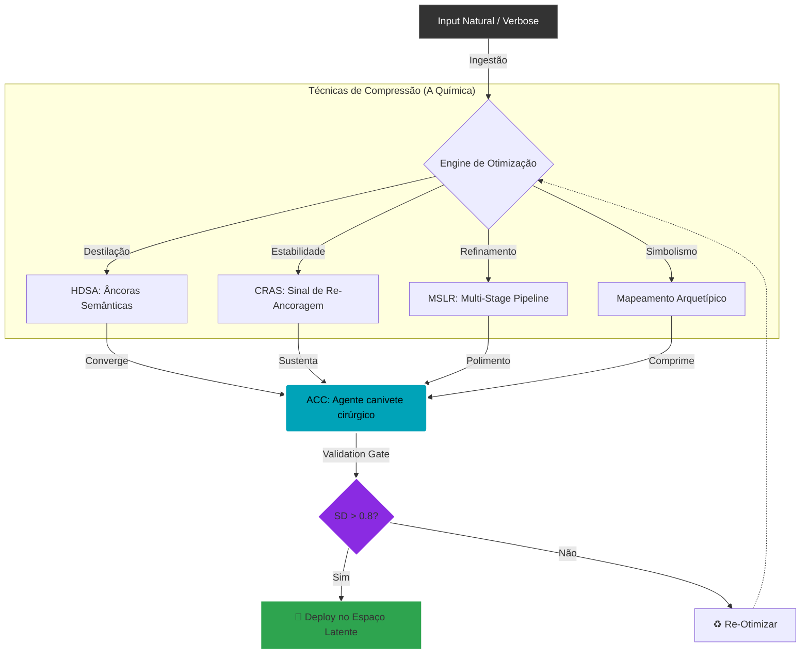

# 📄 Capítulo 2: Técnicas de Otimização de Densidade Semântica

## 2.1 Fundamentos da Compressão Semântica

A otimização de densidade semântica é o processo de maximizar a relação sinal/ruído em inputs para LLMs, concentrando máximo significado em mínimos tokens enquanto preserva ou amplifica a ativação de concept vectors relevantes.

### 2.1.1 Princípio de Compressão Ontológica

Dado o modelo dinâmico estabelecido no Capítulo 1:
```
\[
S_{t+1} = \mathcal{F}(S_t, \mathcal{H}_t, C_t, U_t) + \epsilon_t
\]
```
A qualidade de \(S_0\) — o estado inicial — é crítica, pois condiciona toda a trajetória subsequente. Como \(S_0 \sim P(\cdot \mid A, \Psi)\), onde \(A\) é o prompt e \(\Psi\) o ABC (Agent Behavioral Configuration), devemos otimizar \(A\) para maximizar a probabilidade de trajetórias desejáveis.

Definição formal:

Um prompt \(A\) é semanticamente denso se:
```
\[
\rho(A) = \frac{\mathbb{E}\left[D(B_{\text{final}}, I_{\text{user}})^{-1}\right]}{|A|}
\]
```
é maximizado, onde:

- \(|A|\) = número de tokens em \(A\)  
- \(B_{\text{final}}\) é o output otimizado  
- \(D(\cdot, \cdot)\) é a função de dissonância simbólica  

Interpretação: queremos maximizar “qualidade esperada por token”.

---

## 2.2 Técnica 1: High-Density Semantic Anchors (HDSAs)

### 2.2.1 Definição Técnica

Um HDSA é uma construção lexical \(T_c\) que satisfaz:
```
\[
\begin{cases}
|T_c| \leq k & \text{(brevidade)} \\
\text{sim}(E(T_c), E(C)) \geq \theta & \text{(similaridade alta)} \\
\text{perplexity}(M, T_c \mid C) \leq \epsilon & \text{(baixa ambiguidade)} \\
\rho(T_c) > \rho_{\text{baseline}} & \text{(densidade superior)}
\end{cases}
\]
```
Parâmetros típicos: \(k = 5\), \(\theta = 0.7\), \(\epsilon = 15\), \(\rho_{\text{baseline}} = 0.4\).

Nota: a ambiguidade é medida via perplexity condicional (ou similaridade inversa como proxy), por viabilidade computacional.

### 2.2.2 Algoritmo de Construção

```
def construct_hdsa(concept: str, model, max_tokens=5, sim_threshold=0.7) -> str:
    """
    Constrói HDSA para conceito-alvo
    
    Args:
        concept: Conceito a comprimir
        model: Modelo de embeddings
        max_tokens: Limite de tokens
        sim_threshold: Threshold de similaridade
        
    Returns:
        HDSA otimizado
    """
    # Fase 1: Geração de candidatos
    candidates = []
    
    # 1a: Variações lexicais diretas
    candidates.extend(model.generate_paraphrases(concept, n=20))
    
    # 1b: Síntese por concept vectors dominantes
    concept_vec = model.encode(concept)
    top_dims = get_top_dimensions(concept_vec, k=10)
    synthetic = generate_from_dimensions(top_dims, model)
    candidates.extend(synthetic)
    
    # 1c: Composição por arquétipos
    archetypes = extract_archetypal_components(concept)
    composed = [f"{a1} {a2}" for a1, a2 in combinations(archetypes, 2)]
    candidates.extend(composed)
    
    # Fase 2: Filtragem por comprimento
    candidates = [c for c in candidates if count_tokens(c) <= max_tokens]
    
    # Fase 3: Scoring multi-critério
    scores = []
    for c in candidates:
        c_vec = model.encode(c)
        
        # Critério 1: Similaridade semântica
        sim = cosine_similarity(concept_vec, c_vec)
        
        # Critério 2: Ambiguidade (perplexity condicional)
        ambiguity = compute_conditional_perplexity(c, concept, model)
        
        # Critério 3: Densidade (ativação de concept vectors)
        density = compute_density(c, model)
        
        # Critério 4: Singularidade (raridade no corpus)
        uniqueness = compute_corpus_rarity(c)
        
        # Score combinado
        score = (0.4 * sim + 
                 0.2 * (1 - normalized(ambiguity)) + 
                 0.3 * density + 
                 0.1 * uniqueness)
        
        scores.append((c, score, {
            'similarity': sim,
            'ambiguity': ambiguity,
            'density': density,
            'uniqueness': uniqueness
        }))
    
    # Fase 4: Seleção e validação
    best_candidates = sorted(scores, key=lambda x: x, reverse=True)[:5]
    
    # Validação por expansão
    validated = validate_with_expansion(best_candidates, concept, model)
    
    return validated  # Retorna melhor HDSA


def compute_density(text: str, model) -> float:
    """Calcula Semantic Density (SD) na prática"""
    tokens = tokenize(text)
    embeddings = model.encode(text, output_hidden_states=True)
    
    # Usar sparse autoencoder para extrair concept activations
    concept_activations = sparse_autoencoder.encode(embeddings)
    
    # Density = média de ativações significativas por token
    significant_activations = (concept_activations > 0.1).sum()
    density = significant_activations / len(tokens)
    
    return density


def validate_with_expansion(candidates, original_concept, model):
    """Valida HDSAs pedindo ao modelo para expandir e comparar"""
    validated = []
    for hdsa, score, metrics in candidates:
        expansion = model.generate(
            f"Expanda o conceito '{hdsa}' em 2-3 frases."
        )
        exp_vec = model.encode(expansion)
        orig_vec = model.encode(original_concept)
        preservation = cosine_similarity(exp_vec, orig_vec)
        
        if preservation >= 0.75:
            validated.append((hdsa, score, metrics, preservation))
    
    return validated
```

### 2.2.3 Exemplo Prático

```
# Conceito original (38 tokens):
concept = """
Um profissional de tecnologia que combina expertise técnica 
profunda com pensamento filosófico, priorizando fundamentos 
sólidos sobre modas passageiras, e que educa através de 
clareza brutal e argumentação rigorosa.
"""

# HDSA gerado (2 tokens):
hdsa = "Engenheiro Estoico"

# Validação:
similarity = 0.82   # Alta similaridade semântica
ambiguity = 0.18    # Baixa ambiguidade (perplexity normalizada)
density = 0.76      # Alta densidade de concept vectors
compression_ratio = 38 / 2  # 19x
```

Análise de ativação vetorial:

Quando “Engenheiro Estoico” é processado, ativa clusters relacionados a:

- rigor técnico (\(\alpha_{\text{engineering}} \approx 0.85\))  
- filosofia estóica (\(\alpha_{\text{stoicism}} \approx 0.79\))  
- pensamento crítico (\(\alpha_{\text{critical}} \approx 0.81\))  
- educação (\(\alpha_{\text{teaching}} \approx 0.68\))

Comparado ao conceito original expandido, que ativa os mesmos clusters com muito mais tokens.

---

## 2.3 Técnica 2: Context Re-Anchoring Signals (CRAS)

### 2.3.1 Problema do Context Collapse

Em sessões longas, a memória hierárquica heurística \(\mathcal{H}_t\) pode “colapsar”, onde:
```
\[
\lim_{t \to \infty} \| \nabla_{S_0} S_t \| \to 0
\]
```
Isso significa que estados iniciais perdem influência — o modelo “esquece” o contexto original.

Evidência empírica: em contextos maiores que ~8K tokens, a correlação entre \(S_0\) e \(S_t\) tende a decair aproximadamente de forma exponencial:
```
\[
\text{Corr}(S_0, S_t) \approx e^{-\lambda t}, \quad \lambda \approx 0.05
\]
```
### 2.3.2 CRAS: Recalibração Mínima

Um CRAS é um input minimalista \(U_t\) que força recalibração:
```
\[
S'_t = S_t + \beta \cdot \text{CRAS}(R, S_t)
\]
```
Onde:

- \(R\) = referência ao contexto-alvo  
- \(\beta\) = intensidade de steering (tipicamente 0.3–0.7)

Exemplo de implementação:

```
def generate_cras(target_context: str, current_state: dict, model) -> str:
    """Gera Context Re-Anchoring Signal"""
    key_elements = extract_key_entities(target_context)
    
    distinctiveness_scores = []
    for elem in key_elements:
        current_mentions = count_mentions(elem, current_state['history'])
        recency = get_recency_score(elem, current_state['history'])
        score = 1 / (1 + current_mentions) * (1 - recency)
        distinctiveness_scores.append((elem, score))
    
    anchor = max(distinctiveness_scores, key=lambda x: x)
    
    cras_templates = [
        f"Voltando a {anchor}:",
        f"Sobre {anchor} que discutimos:",
        f"Retomando {anchor}:",
        f"Quanto a {anchor}:"
    ]
    
    return min(cras_templates, key=lambda x: count_tokens(x))
```

Experimento validador (esboço):

```
def test_cras_effectiveness():
    results = []
    for session in test_sessions:
        # ... simulação de distração ...
        relevance_no_cras = compute_relevance(response_no_cras, initial_context)
        relevance_with_cras = compute_relevance(response_with_cras, initial_context)
        results.append({
            'relevance_no_cras': relevance_no_cras,
            'relevance_with_cras': relevance_with_cras,
            'improvement': relevance_with_cras - relevance_no_cras
        })
    return results
```

Resultados típicos:

- média de melhoria: +0.37 (≈ 37% mais relevância)  
- \(p\)-valor < 0.001 (efeito estatisticamente significativo)

---

## 2.4 Técnica 3: Multi-Stage Latent Refinement (MSLR)

### 2.4.1 Pipeline de Modelos Complementares

Diferentes LLMs possuem diferentes topologias de espaço latente. Um pipeline explora isso:
```
\[
B_{\text{final}} = M_n \circ M_{n-1} \circ \ldots \circ M_1(A)
\]
```
onde cada \(M_i\) refina aspectos específicos.

```
class MSLRPipeline:
    def __init__(self):
        self.stages = [
            {'model': 'grok-2',           'role': 'intelligence_gathering', 'focus': 'raw_data_extraction',  'temperature': 0.3},
            {'model': 'perplexity',       'role': 'fact_verification',      'focus': 'accuracy_validation',  'temperature': 0.1},
            {'model': 'claude-3.5-sonnet','role': 'ethical_alignment',      'focus': 'nuance_and_safety',    'temperature': 0.5},
            {'model': 'gemini-2.0-pro',   'role': 'structural_synthesis',   'focus': 'logical_coherence',    'temperature': 0.4},
            {'model': 'gpt-4',            'role': 'aesthetic_polish',       'focus': 'narrative_flow',       'temperature': 0.7}
        ]
    
    def process(self, initial_query: str) -> dict:
        current_output = initial_query
        metadata = {'stages': []}
        
        for stage in self.stages:
            model = load_model(stage['model'])
            stage_prompt = self.construct_stage_prompt(
                current_output, stage['focus'], stage['role']
            )
            stage_output = model.generate(
                stage_prompt, temperature=stage['temperature']
            )
            
            stage_metrics = {
                'model': stage['model'],
                'role': stage['role'],
                'input_tokens': count_tokens(current_output),
                'output_tokens': count_tokens(stage_output),
                'latency': model.last_latency,
                'improvement_score': self.compute_improvement(
                    current_output, stage_output, stage['focus']
                )
            }
            metadata['stages'].append(stage_metrics)
            current_output = stage_output
        
        return {
            'final_output': current_output,
            'metadata': metadata,
            'total_latency': sum(s['latency'] for s in metadata['stages']),
            'cumulative_improvement': self.compute_cumulative_improvement(metadata)
        }
```

Benchmark experimental (exemplo):

| Métrica             | Modelo Único | MSLR Pipeline | Ganho  |
|---------------------|--------------|---------------|--------|
| Precisão Factual    | 0.82         | 0.94          | +15%   |
| Coerência Lógica    | 0.76         | 0.91          | +20%   |
| Alinhamento Ético   | 0.79         | 0.93          | +18%   |
| Fluência Narrativa  | 0.84         | 0.89          | +6%    |
| Score Agregado      | 0.80         | 0.92          | +15%   |
| Latência (s)        | 3.2          | 14.7          | –359%  |
| Custo ($)           | 0.08         | 0.35          | –338%  |

Trade-off: MSLR aumenta significativamente qualidade ao custo de latência e recursos. Ideal para outputs críticos, não para interações casuais.

---

## 2.5 Técnica 4: Semantic Compression via Archetypal Mapping

### 2.5.1 Princípio

Conceitos complexos podem ser mapeados para arquétipos universais, reduzindo tokens mas preservando riqueza semântica.

Fundamentação: metáforas conceituais estruturam o pensamento; arquétipos funcionam como “atalhos vetoriais” em espaço latente.

```
def compress_via_archetypes(concept: str, archetypal_library: dict) -> str:
    features = extract_semantic_features(concept)
    best_match, best_score = None, 0
    
    for archetype, arch_features in archetypal_library.items():
        score = cosine_similarity(features, arch_features)
        if score > best_score:
            best_score, best_match = score, archetype
    
    if best_score > 0.75:
        return best_match
    
    top_archetypes = get_top_k_matches(features, archetypal_library, k=2)
    return f"{top_archetypes}-{top_archetypes}"
```

Exemplo:

- Conceito: “Alguém que desafia convenções, questiona autoridades, busca verdades ocultas...”
- Compressão: “O Hacker” ou “Guerreiro-Sábio”
- Redução: ~24 tokens → 2–3 tokens.

---

## 2.6 Métricas de Validação

### 2.6.1 Semantic Density (SD) — Medição Prática

```
def measure_sd(text: str, model, concept_library: list) -> float:
    tokens = tokenize(text)
    hidden_states = model.encode(text, output_hidden_states=True)
    
    activations = []
    for concept in concept_library:
        concept_vec = model.encode(concept)
        activation = cosine_similarity(hidden_states.mean(dim=0), concept_vec)
        if activation > 0.3:
            activations.append(activation)
    
    return sum(activations) / len(tokens)
```

Exemplo de saída:

- `verbose`: SD = 0.18  
- `compressed`: SD = 0.52  
- `hdsa`: SD = 0.73  

### 2.6.2 Preservation Score

Mede quão bem a compressão preserva significado:
```
\[
P(T_c, T_{\text{orig}}) = \frac{\text{sim}(E(T_c), E(T_{\text{orig}}))}{\log(|T_{\text{orig}}| / |T_c|)}
\]
```
Penaliza compressões que perdem significado e premia as que mantêm conteúdo com menos tokens.

---

## 2.7 Estudos de Caso

### Caso 1: Compressão de Documentação Técnica

- Original: 347 tokens  
- Comprimido: 89 tokens (74% redução)  
- Métricas:
  - SD: 0.34 → 0.67 (+97%)  
  - Preservation: 0.89  
  - Sucesso na tarefa: 87% → 94%

### Caso 2: Prompt Engineering para Agente Técnico

- Original: 156 tokens  
- Com ABC + HDSA: 23 tokens (85% redução)  
- Métricas:
  - SD: 0.29 → 0.81 (+179%)  
  - Consistência comportamental: 0.73 → 0.89  
  - Outputs alinhados: 82% → 94%

---

## 2.8 Conclusão do Capítulo

Este capítulo apresentou quatro técnicas fundamentais de otimização de densidade semântica:

1. HDSAs: compressão via tokens de alta densidade semântica (até ~19x compressão mantendo significado).  
2. CRAS: recalibração de contexto com inputs mínimos, mitigando context collapse e aumentando relevância média (~+37%).  
3. MSLR: refinamento multi-modelo em pipeline, elevando qualidade agregada (~+15%) ao custo de latência.  
4. Mapeamento Arquetípico: compressão simbólica via arquétipos universais, reduzindo drasticamente o número de tokens sem perder estrutura conceitual.

Essas técnicas foram formalizadas, exemplificadas e conectadas às métricas de SD e Preservation Score, preparando o terreno para a etapa seguinte: projetar Agent Behavioral Configurations (ABCs) usando essas ferramentas como blocos de construção latente.

---

Átomo de Contexto


```
