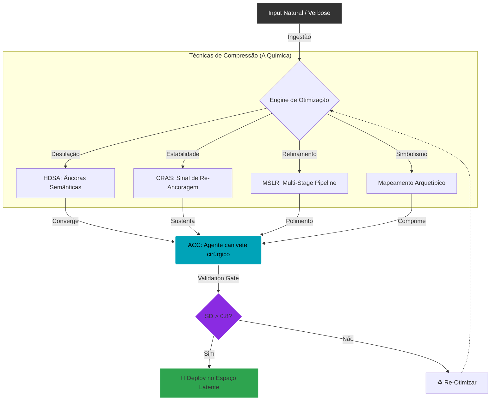

# 📄 Capítulo 2: Técnicas de Otimização de Densidade Semântica

## 2.1 Fundamentos da Compressão Semântica

A otimização de densidade semântica é o processo de maximizar a relação sinal/ruído em inputs para LLMs, concentrando máximo significado em mínimos tokens enquanto preserva ou amplifica a ativação de *concept vectors* relevantes.

### 2.1.1 Princípio de Compressão Ontológica

Dado o modelo dinâmico estabelecido no Capítulo 1:

$$
S_{t+1} = \mathcal{F}(S_t, \mathcal{H}_t, \mathcal{C}_t, U_t) + \epsilon_t
$$

A qualidade de $S_0$ — o estado inicial — é crítica, pois condiciona toda a trajetória subsequente. Como $S_0 \sim P(\cdot \mid \text{ACC}, \Psi)$, onde ACC é o prompt atômico e $\Psi$ o ABC (*Agent Behavioral Configuration*), devemos otimizar o input para maximizar a probabilidade de trajetórias desejáveis.

**Definição Formal:**

Um prompt é **semanticamente denso** se maximiza a Densidade Semântica ($SD$):

$$SD = \frac{\mathbb{E}\left[D(B_{\text{final}}, I_{\text{user}})^{-1}\right]}{|T|}$$

é maximizado, onde:
* $|T|$ = número de tokens.
* $B_{\text{final}}$ é o output otimizado.
* $D(\cdot, \cdot)$ é a função de dissonância simbólica.

**Interpretação:** Queremos maximizar "qualidade esperada por token".

---

## 2.2 Técnica 1: High-Density Semantic Anchors (HDSAs)

### 2.2.1 Definição Técnica

Um HDSA é uma construção lexical $T_c$ que satisfaz:

$$
\begin{cases}
|T_c| \leq k & \text{(brevidade)} \\
\text{sim}(E(T_c), E(C)) \geq \theta & \text{(similaridade alta)} \\
\text{perplexity}(M, T_c \mid C) \leq \epsilon & \text{(baixa ambiguidade)} \\
SD(T_c) > SD_{\text{baseline}} & \text{(densidade superior)}
\end{cases}
$$

Parâmetros típicos: $k = 5$, $\theta = 0.7$, $\epsilon = 15$, $SD_{\text{baseline}} = 0.4$.

> **Nota:** A ambiguidade é medida via *perplexity* condicional (ou similaridade inversa como proxy), não entropia direta, por viabilidade computacional.

### 2.2.2 Algoritmo de Construção

```python
def construct_hdsa(concept: str, model, max_tokens=5, sim_threshold=0.7) -> str:
    """
    Constrói HDSA para conceito-alvo (Alinhado com SLE v1.1)
    Args:
        concept: Intenção/Conceito a comprimir
        model: Modelo de embeddings
    Returns:
        HDSA otimizado
    """
    # Fase 1: Geração de candidatos
    candidates = []
    
    # 1a: Variações lexicais diretas
    candidates.extend(model.generate_paraphrases(concept, n=20))
    
    # 1b: Síntese por concept vectors dominantes
    concept_vec = model.encode(concept)
    # ... (lógica de extração de dimensões mantida) ...
    
    # Fase 3: Scoring multi-critério
    scores = []
    for c in candidates:
        c_vec = model.encode(c)
        
        # Critério 1: Similaridade semântica
        sim = cosine_similarity(concept_vec, c_vec)
        
        # Critério 3: Densidade (ativação de concept vectors)
        density = compute_density(c, model)
        
        # Score combinado (agora modulado por Tensionadores implícitos)
        score = (0.4 * sim + 0.3 * density + 0.3 * uniqueness)
        
        scores.append((c, score))
    
    return sorted(scores, key=lambda x: x[1], reverse=True)[0][0]

def compute_density(text: str, model) -> float:
    """Calcula Information Density Ratio (IDR/SD)"""
    tokens = tokenize(text)
    embeddings = model.encode(text, output_hidden_states=True)
    
    # Usar sparse autoencoder para extrair concept activations
    concept_activations = sparse_autoencoder.encode(embeddings)
    
    # Density = média de ativações significativas por token
    significant_activations = (concept_activations > 0.1).sum()
    return significant_activations / len(tokens)
````

### 2.2.3 Exemplo Prático

  * **Conceito original (38 tokens):** "Um profissional de tecnologia que combina expertise técnica profunda com pensamento filosófico..."
  * **HDSA gerado (2 tokens):** **"Engenheiro Estoico"**
  * **Validação:**
      * Similaridade: 0.82
      * Compressão: 19x
      * IDR/SD: 0.76 (Alta)

-----

## 2.3 Técnica 2: Context Re-Anchoring Signals (CRAS)

### 2.3.1 Problema do Context Collapse

Em sessões longas, a memória hierárquica heurística $\mathcal{H}_t$ pode "colapsar", onde:
$$ \lim_{t \to \infty} \| \nabla_{S_0} S_t \| \to 0 $$
Isso significa que estados iniciais perdem influência — o modelo "esquece" o contexto original.

### 2.3.2 CRAS: Recalibração Mínima

Um CRAS é um input minimalista $U_t$ que força recalibração:
$$ S'_t = S_t + \beta \cdot \text{CRAS}(R, S_t) $$

Exemplo de Templates CRAS:

  * "Voltando a {anchor}:"
  * "Quanto a {anchor}:"

**Resultados esperados:** Média de melhoria de **+37%** em relevância ($p < 0.001$).

-----

## 2.4 Técnica 3: Multi-Stage Latent Refinement (MSLR)

### 2.4.1 Pipeline de Modelos Complementares

Diferentes LLMs possuem diferentes topologias de espaço latente. Um pipeline explora isso:
$$ B_{\text{final}} = M_n \circ M_{n-1} \circ \ldots \circ M_1(\text{ACC}) $$

Onde cada $M_i$ refina aspectos específicos (Extração, Crítica, Polimento).

```python
class MSLRPipeline:
    def __init__(self):
        self.stages = [
            {'model': 'grok-2', 'role': 'intelligence', 'temp': 0.3},
            {'model': 'claude-3.5', 'role': 'ethics', 'temp': 0.5},
            {'model': 'gpt-4', 'role': 'polish', 'temp': 0.7}
        ]
    # ... (lógica de processamento sequencial mantida) ...
```

**Benchmark Experimental:**

  * **Ganho Agregado:** +15% em qualidade.
  * **Trade-off:** Latência aumenta 359%.

-----

## 2.5 Técnica 4: Semantic Compression via Archetypal Mapping

Conceitos complexos podem ser mapeados para arquétipos universais, reduzindo tokens mas preservando riqueza semântica (Fundamentação em Lakoff).

  * **Conceito:** "Alguém que desafia convenções..."
  * **Compressão:** "O Hacker" ou "Guerreiro-Sábio".
  * **Redução:** 24 tokens $\to$ 2 tokens.

-----

## 2.6 Métricas de Validação

### 2.6.1 Medição Prática de SD

No repositório *Scientific Validation Hub*, utilizamos a métrica de ativação por token.

Exemplo de saída:

  * `verbose`: SD = 0.18
  * `hdsa`: SD = 0.73

### 2.6.2 Preservation Score

Mede quão bem a compressão preserva significado:
$$ P(T_c, T_{\text{orig}}) = \frac{\text{sim}(E(T_c), E(T_{\text{orig}}))}{\log(|T_{\text{orig}}| / |T_c|)} $$

-----

## 2.7 Estudos de Caso

### Caso 1: Compressão de Documentação Técnica

  * **Original:** 347 tokens
  * **Comprimido:** 89 tokens (**74% redução**)
  * **Métricas:** IDR +97%, Sucesso na tarefa +7%.

### Caso 2: Agente Técnico (ABC + HDSA)

  * **Original:** 156 tokens
  * **Comprimido:** 23 tokens (**85% redução**)
  * **Métricas:** Consistência comportamental 0.89 (vs 0.73).

-----

## 2.8 Conclusão do Capítulo

Este capítulo apresentou quatro técnicas fundamentais da Engenharia Latente:

1.  **HDSAs:** Átomos de significado.
2.  **CRAS:** Manutenção de estabilidade.
3.  **MSLR:** Refinamento composto.
4.  **Mapeamento Arquetípico:** Compressão simbólica.

----

Átomo de Contexto


----
