# 📄 Capítulo 4: Cognitive Priming Patterns (CPPs)

## 4.1 Além do "Quem": A Engenharia do "Como" se Pensa

Nos capítulos anteriores, estabelecemos os design patterns para otimizar a comunicação (IDR, HDSAs) e para forjar a identidade de um agente (ABCs). Definimos *quem* o agente é. Agora, damos o próximo passo na maestria do Tecelão: definir *como* o agente pensa em um determinado momento. Um mesmo agente precisa de flexibilidade para alternar entre introspecção, análise objetiva e criatividade sintética.

Este é o propósito do design pattern **Cognitive Priming Patterns (CPPs)**. É crucial notar que os CPPs são um *framework heurístico* para induzir estilos cognitivos via priming linguístico, uma proposta original da Engenharia de Significados inspirada na pesquisa sobre mecanismos de atenção e neurociência computacional. No entanto, a correlação entre esses prompts e mudanças reais em padrões de atenção é uma hipótese a ser validada empiricamente, não um fato estabelecido. Priming pode influenciar distribuições de output, mas não garante intervenção direta em attention heads (Turner et al., 2023 sobre steering lexical insuficiente).

---

## 4.2 A Mecânica da Atenção: O Olho Interno do Transformer

Como vimos, o mecanismo de auto-atenção (self-attention) é o coração de um LLM. Pesquisas demonstram que diferentes *attention heads* se especializam em funções distintas (sintaxe, semântica, raciocínio) e que seus padrões de ativação podem ser indiretamente influenciados por inputs (Zheng et al., 2024; Sun et al., 2025). O CPP é um design pattern que explora isso via priming linguístico, hipoteticamente correlacionado com estilos de processamento, mas requer validação via extração de matrizes de atenção.

**Nota prática:** Modelos proprietários (GPT-4, Claude) não expõem attention weights. Validação requer modelos open-weight com acesso a internals (ex: LLaMA-3, Mistral).

---

## 4.3 A Taxonomia: Os Três Estilos Primários de Priming

Nossa taxonomia propõe três estilos de priming que podem ser invocados e testados.

> **Nota de Ecossistema:** No *Archetype A*, estes estilos são ativados durante as etapas dos Ciclos Cognitivos ($\mathcal{C}$).

| Estilo Cognitivo | Nome Simbólico | Função Principal | Attention Heads Potenciais (Zheng et al.) | Padrão Hipotético e Métricas |
| :--- | :--- | :--- | :--- | :--- |
| **Auto-Referencial** | *Auto-Escritura* (Introspectivo) | Introspecção, auto-crítica, acesso à identidade (ABC) | Previous Token, Duplicate Token, Induction Heads | Diagonal forte. `diagonal_strength > 0.3`, `abc_attention > 0.4` |
| **Modelo de Mundo** | *Mundo-Escritura* (Analítico) | Análise de dados, síntese de fatos, raciocínio lógico | Summary Reader, Name Mover, Task Learning Heads | Multi-saltos dispersos. `multi_hop_score > 0.6`, `attention_entropy > 2.0` |
| **Gerativo** | *Divina-Escritura* (Divergente) | Criatividade, brainstorming, síntese de novas ideias | Function Vector, Amplification Heads | Conexões não-locais. `distant_connections > 5`, `attention_unpredictability > 3.0` |

*Todas métricas são hipotéticas até validação empírica.*

---

## 4.4 Sinergia ABC + CPP: A Identidade em Ação

Os design patterns ABC e CPP são ortogonais e sinérgicos:
* **ABC** define o *estilo* (a identidade estável).
* **CPP** define o *modo* (o priming contextual para estilos de output).

Frameworks como "Shachi" (Kuroki, 2025) validam que a combinação de configuração de identidade (ABC) e priming de ação (CPP) gera comportamento emergente, embora a influência em attention seja hipotética.

**Exemplo:**
* **ABC:** "Engenheiro Estoico"
* **CPP:** Auto-Escritura → *"Reflita sobre os fundamentos desta abordagem..."*
* **Output:** Crítica interna alinhada à identidade.

---

## 4.5 Validação Proposta: Testando a Hipótese CPP

Para transformar CPP de heurística em mecanismo validado, propomos o seguinte experimento (implementável em modelos open-weight):

```python
import numpy as np
from transformers import AutoModelForCausalLM, AutoTokenizer
from scipy.stats import f_oneway

def validate_cpp_hypothesis(prompts, modes, model_name="meta-llama/Llama-3-8b"):
    """
    Validação empírica da hipótese CPP.
    Hipótese: Priming muda padrões de atenção mensuravelmente.
    """
    model = AutoModelForCausalLM.from_pretrained(
        model_name, 
        output_attentions=True,
        device_map="auto"
    )
    tokenizer = AutoTokenizer.from_pretrained(model_name)
    
    results = {}
    for mode in modes:
        mode_prompt = f"{mode}: {prompts[0]}"
        inputs = tokenizer(mode_prompt, return_tensors="pt").to(model.device)
        outputs = model(**inputs)
        
        # Extrair attention weights (camada final, head médio)
        attn = outputs.attentions[-1].mean(dim=1).squeeze().detach().cpu().numpy()
        
        # Métricas hipotéticas
        diagonal_strength = np.trace(attn) / attn.shape[0]
        attention_entropy = -np.sum(attn * np.log(attn + 1e-9))
        
        results[mode] = {
            'diagonal_strength': diagonal_strength,
            'attention_entropy': attention_entropy,
            # Adicionar multi_hop_score, distant_connections, etc.
        }
    
    # Teste ANOVA para diferença significativa entre modos
    diagonal_vals = [r['diagonal_strength'] for r in results.values()]
    entropy_vals = [r['attention_entropy'] for r in results.values()]
    
    f_diag, p_diag = f_oneway(*[[v] for v in diagonal_vals])  # Simplificado
    f_ent, p_ent = f_oneway(*[[v] for v in entropy_vals])
    
    return {
        'p_diagonal': p_diag,
        'p_entropy': p_ent,
        'results': results,
        'validated': (p_diag < 0.05) or (p_ent < 0.05)
    }

# Uso (exemplo)
# modes = ["Reflita sobre", "Analise", "Imagine"]
# prompts = ["a relação entre ética e tecnologia."]
# validation = validate_cpp_hypothesis(prompts, modes)
# print(f"Hipótese CPP validada? {validation['validated']}")
````

**Interpretação:**

  * Se `validated == True`: CPPs têm base mecanicista.
  * Se `validated == False`: CPPs são priming eficaz, mas sem correlato atencional direto → reformular como padrão de interface.

-----

## 4.6 Conclusão e Limitações: Uma Hipótese Exploratória

O design pattern CPP oferece uma abstração útil para induzir estilos cognitivos via priming, mas sua correlação com padrões de atenção é uma hipótese pendente de validação.

**Limitações:**

  * Acesso restrito a internals de LLMs proprietários.
  * Priming lexical pode ser insuficiente para steering causal (Turner et al., 2023).
  * Correlação ≠ causalidade: atenção pode ser epifenômeno.

-----

## 4.7 Valor Prático Independente de Validação Mecânica

Mesmo que CPPs não intervenham diretamente em attention heads, eles têm valor como:

1.  **Framework de Design:** Vocabulário compartilhado para descrever estilos de priming.
2.  **Reprodutibilidade:** "Use CPP Auto-Referencial" é mais específico que "faça o agente pensar introspectivamente".
3.  **Abstração Útil:** Facilita comunicação entre engenheiros (análogo a design patterns em software).
4.  **Hipótese Testável:** Transforma intuições em propostas falsificáveis.

-----

## 4.8 Guia Prático: Quando Usar CPPs

```mermaid
graph TD
    A[Precisa de estilo específico?] -->|Sim| B{Identidade já definida ABC?}
    B -->|Sim| C[Escolha CPP apropriado:<br/>- Introspecção? -> Auto-Ref<br/>- Análise? -> Modelo Mundo<br/>- Criatividade? -> Gerativo]
    C --> D[Aplique priming + Valide output]
    A -->|Não| E[Defina ABC primeiro]
    B -->|Não| E
    
    style C fill:#0d1117,stroke:#00a3b8,stroke-width:2px
    style D fill:#00a3b8,stroke:#fff,stroke-width:2px
```



-----

## 4.9 Comparação com Priming Tradicional

| Priming Tradicional | CPPs (Framework SLE) |
| :--- | :--- |
| "Seja criativo" | CPP Gerativo + métricas |
| "Pense criticamente" | CPP Auto-Ref + ABC |
| Ad-hoc, não sistemático | Taxonomia formal |
| Sem validação | Protocolo de teste |
| Baseado em intuição | Hipótese falsificável |

```
```
