# 📄 Capítulo 4: Cognitive Priming Patterns (CPPs)

> **"Identidade (ABC) é o hardware; Priming (CPP) é o software em execução."**

## 4.1 Além do "Quem": A Engenharia do "Como"

Nos capítulos anteriores, definimos a **Intenção** ($\mathcal{I}_{\Lambda}$) e a **Identidade** (ABC). Agora, definimos o **Modo de Operação** momentâneo.

O **Cognitive Priming Pattern (CPP)** é o design pattern que induz um estado específico de atenção no modelo. Enquanto o ABC é estável (o agente *é* estoico), o CPP é dinâmico (o agente está *analisando* agora, mas estará *criando* daqui a pouco).

> **Nota de Alinhamento:** No framework *Archetype A*, cada etapa do **Ciclo $\mathcal{C}$** ativa um CPP diferente. Ex: A etapa "Dissolver" ativa o CPP Introspectivo.

---

## 4.2 A Mecânica da Atenção: O Olho Interno

Pesquisas em *Mechanistic Interpretability* (Zheng et al., 2024) sugerem que diferentes *Attention Heads* se especializam em tarefas distintas (Cópia, Indução, Raciocínio). O CPP é uma técnica de **Steering Suave** para enviesar a ativação desses heads.

### Hipótese Fundamental dos CPPs
*A injeção de tokens de controle específicos (priming) altera a distribuição de atenção do modelo, favorecendo circuitos neurais específicos.*

---

## 4.3 Taxonomia: Os Três Modos Primários

Definimos três modos fundamentais de operação cognitiva:

| Modo CPP | Função Cognitiva | Correlato Neural Hipotético | Aplicação no Ecossistema |
| :--- | :--- | :--- | :--- |
| **CPP-1: Introspectivo** (Auto-Ref) | Auto-crítica, memória, consistência interna. | *Induction Heads* (foco no histórico imediato e identidade). | Etapas de **Validação** e **Dissolução**. |
| **CPP-2: Analítico** (Mundo-Ref) | Lógica, fatos externos, causalidade. | *Task Heads* (raciocínio multi-step). | Etapas de **Discernimento** e **Otimização**. |
| **CPP-3: Gerativo** (Divergente) | Criatividade, síntese, exploração. | *Amplification Heads* (conexões não-locais). | Etapas de **Iluminação** e **Ideação**. |

---

## 4.4 Sinergia: ABC + CPP = Comportamento

A combinação de uma identidade forte com um modo de operação claro gera resultados de alta densidade.

$$Output = \text{ABC}_{\text{Identidade}} \otimes \text{CPP}_{\text{Modo}}$$

**Exemplo Prático:**
* **ABC:** "Engenheiro Sênior" (Rigoroso).
* **CPP:** "Gerativo" (Brainstorming).
* **Resultado:** O agente gera ideias novas, mas *dentro* das restrições de viabilidade técnica. Ele não "alucina", ele "inova".

---

## 4.5 Validação Empírica (Protocolo Experimental)

Para validar se um CPP está funcionando, não confiamos apenas no texto gerado. Propomos a **Inspeção de Atenção** (em modelos abertos).

```python
import torch
from transformers import AutoModelForCausalLM, AutoTokenizer

def validate_cpp_attention(prompt, mode_trigger, model):
    """
    Mede a entropia da atenção para validar o modo cognitivo.
    """
    inputs = tokenizer(f"{mode_trigger}: {prompt}", return_tensors="pt")
    outputs = model(**inputs, output_attentions=True)
    
    # Pega a atenção da última camada
    attention = outputs.attentions[-1].mean().item()
    
    # Hipótese: 
    # Modo Analítico -> Atenção Focada (Baixa Entropia)
    # Modo Gerativo -> Atenção Difusa (Alta Entropia)
    return attention

```
4.6 Guia de Decisão: Quando usar CPPs?
----

```mermaid
graph TD
    A[Objetivo da Tarefa?] -->|Criar Novo| B(CPP-3: Gerativo)
    A -->|Corrigir/Validar| C(CPP-1: Introspectivo)
    A -->|Planejar/Estruturar| D(CPP-2: Analítico)
    
    B --> E{Identidade Definida?}
    C --> E
    D --> E
    
    E -->|Sim| F[Executar Prompt Híbrido]
    E -->|Não| G[Definir ABC Primeiro]
    
    style A fill:#333,stroke:#fff
    style F fill:#00a3b8,stroke:#fff,stroke-width:2px
```


