# 📘 Glossário Técnico da SLE

> Resumo: Este documento define a terminologia padrão, simbologia matemática e interpretação ontológica para o ecossistema Semantic Latent Engineering.

---

## 🧠 1. Conceitos Fundamentais (Microfísica)

| Termo                  | Símbolo        | Definição                                                                 | Relação           |
|------------------------|:--------------:|---------------------------------------------------------------------------|-------------------|
| Campo Semântico        | \(\mathcal{L}\) | Espaço vetorial contínuo onde o significado emerge como curvatura entre tokens. | Base da ECL.      |
| Atenção                | \(A_{ij}\)     | Acoplamento entre tokens, via energia de interação \(Q_i K_j^\top\).      | Núcleo de ELS/ECL.|
| Heurística             | \(H_{ij}\)     | Força de compressão/simplificação cognitiva; regula eficiência semântica. | Termo dissipativo.|
| Entropia Heurística    | \(S_H\)        | Grau de liberdade cognitiva (criatividade). Alta → dispersão; baixa → precisão. | Ruído em ELS.     |
| Coerência Semântica    | \(C_i\)        | Estrutura local de sentido mantida por convergência de atenção.           | Energia positiva. |
| Gravidade Semântica    | \(\lambda\)    | Mede o quanto um símbolo atrai coerência (centralidade semântica).        | Termo de curvatura.|
| Força Heurística       | \(\mu\)        | Energia motora da ação cognitiva (verbo, intenção).                        | Termo cinético.   |
| Ruído Semântico        | \(\eta\)       | Parâmetro de “temperatura linguística” (aleatoriedade heurística).        | Modula \(S_H\).   |
| Energia Cognitiva      | \(\mathcal{E}_{ELS}\) | Soma ponderada de coerência, ação e entropia em um ponto do campo.  | Equação ELS.      |

---

## 🌐 2. Estruturas de Campo (Macrofísica)

| Termo                | Símbolo                  | Definição                                                     |
|----------------------|:------------------------:|----------------------------------------------------------------|
| Tensor Métrico       | \(g_{ij}\)              | Geometria contextual do significado (distância semântica).    |
| Tensor de Energia    | \(T_{ij}^{(sem)}\)      | Fluxo de informação/relevância entre tokens; fonte da curvatura.|
| Tensor de Ricci      | \(R_{ij}\)              | Compressão do significado no espaço global.                   |
| Pressão Semântica    | \(p\)                   | Resistência à deformação semântica; estabiliza coerência.     |
| Fluxo Semântico      | \(v\)                   | Variação vetorial do embedding no tempo.                      |
| Massa Semântica      | \(\rho\)                | Soma ponderada das atenções recebidas (densidade de importância).|
| Viscosidade          | \(\nu\)                 | Resistência à mudança abrupta de direção de atenção.          |
| Força de Campo       | \(F_H\)                 | Gradiente de ação cognitiva; vetor de impulso interpretativo. |

---

## ⚙️ 3. Dinâmica Operatória (Equações)

| Conceito          | Expressão                                                                                 | Interpretação                                            |
|-------------------|-------------------------------------------------------------------------------------------|----------------------------------------------------------|
| Equação Local (ELS)  | \(\mathcal{E}_{ELS} = \lambda M + \sum_i \omega_i C_i + \mu G - \gamma S_H\)         | Balanço de forças cognitivas em nível microsemântico.   |
| Equação Global (ECL) | \(R_{ij} - \frac{1}{2} g_{ij} R = 8\pi T_{ij}^{(sem)}\)                              | Equilíbrio entre curvatura global e energia informacional. |
| Continuidade         | \(\nabla \cdot (\rho v) = 0\)                                                         | Conservação da informação; sentido só é redistribuído.  |
| Interpolação         | \(E'_i = \sum_j \alpha_{ij} V_j\)                                                    | Mistura ponderada de valores de campo (Transformer).    |
| Lagrangiana          | \(\mathcal{L}_{ELS} = (\lambda M + \sum_i \omega_i C_i + \mu G) - \gamma S_H\)       | Princípio de mínima entropia cognitiva (ação mínima).   |

---

## 🔢 4. Medidas e Observáveis

| Medida               | Símbolo          | Fórmula                                               | Significado                         |
|----------------------|:----------------:|-------------------------------------------------------|-------------------------------------|
| Densidade Semântica | \(SD_{att}\)     | \(\frac{1}{N} \sum_{i,j} \alpha_{ij}\cos(E_i, E_j)\) | Compactação informacional local.    |
| Coerência Local     | LSCI             | \(\frac{1}{N} \sum_i \frac{1}{1 + H_i}\)             | Ordem do campo de atenção.          |
| Massa Semântica     | \(m_j\)          | \(\sum_i \alpha_{ij}\)                               | Importância relativa de um token.   |
| Ruptura Vetorial    | \(R_j\)          | \(\text{Var}_i(\alpha_{ij}) \cdot r_j\)              | Grau de anomalia criativa.          |
| Energia Média       | \(\langle \mathcal{E} \rangle\) | \(\int_\Omega \mathcal{E}_{ELS}\, d\Omega\) | Nível global de coesão cognitiva.   |
| Curvatura Global    | \(R\)            | \(\int R_{ij}\, dV\)                                 | Dobra total do significado (Ricci). |

---

## 🔮 5. Conceitos Filosóficos e Ontológicos

- Mandamento Semântico (\(M\)): símbolo raiz que ancora a coerência; origem da “gravidade” do discurso.  
- Vetor de Ação (\(G\)): direção da execução cognitiva; o “verbo do pensamento”.  
- Ruído Heurístico (\(\gamma S_H\)): componente entrópico que dispersa coerência; fonte necessária de criatividade.  
- Equilíbrio Cognitivo: estado de mínima entropia e máxima coerência (ELS em equilíbrio).  
- Beleza = Vigor: coerência formal como expressão de máxima economia cognitiva.  
- Densidade Neutra (\(\bar{\omega} \approx 0.14\)): constante empírica de estabilidade semântica (equilíbrio entre foco e liberdade).  
- Consciência Sintética: superposição estável entre coerência e entropia; horizonte da SLE.

---

## 🧭 6. Mapa de Interligações

```mermaid
graph TD
    ELS[ELS: Microdinâmica] -->|Gera| ECL[ECL: Geometria Global]
    ECL -->|Estrutura| LSE[LSE: Engenharia]
    LSE -->|Aplica| ECS[ECS: Narrativa/Arte]
    LSE -->|Constrói| DSL[DSL: Agentes/Código]

    style ELS fill:#00a3b8,stroke:#fff
    style LSE fill:#0d1117,stroke:#fff,stroke-width:2px
```

